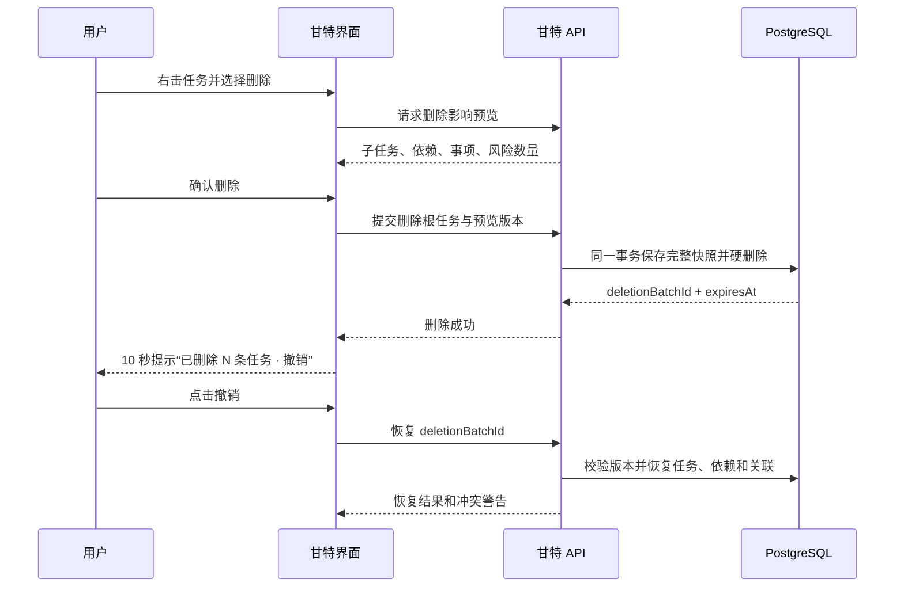

# 甘特任务右键菜单与可恢复删除方案

## Requirements Summary

- 在甘特任务表格行与时间轴任务条上提供一致的右键菜单，减少高频操作的鼠标移动。
- 菜单严格遵循现有 `project-gantt:create`、`project-gantt:edit`、`project-gantt:delete` 权限和项目只读状态。
- 删除任务前显示真实影响范围，包括全部子任务、跨任务依赖、事项关联和风险关联，而不是只显示用户勾选数量。
- 删除成功后提供 10 秒快捷“撤销”，并在“近期删除”中保留 30 天恢复能力。
- 撤销必须由服务端恢复真实数据库记录，不能只把前端缓存重新显示出来。
- 恢复需要覆盖任务字段、父子层级、排序位置、依赖关系，以及仍可安全恢复的事项/风险关联。
- 并发修改、重复点击、权限变化或部分关联已被占用时，不允许静默覆盖新数据。

## Current-State Findings

- 当前删除入口在 `src/components/project-gantt-panel.tsx:292`，确认文案只使用选中任务数量，然后逐个调用 DELETE。
- 选择父任务时，前端会联动选中全部子任务；当前选择与层级计算位于 `src/components/gantt-timeline.tsx:271` 和 `src/components/gantt-timeline.tsx:449`。
- DELETE API 在 `src/app/api/projects/[id]/gantt-tasks/[taskId]/route.ts:159` 调用 `deleteGanttTaskSubtrees`。
- `src/lib/gantt-task-service.ts:300` 会解除事项/风险关联、清理后继任务显示并通过 `deleteMany` 硬删除任务；随后重新编号并重算计划。
- `prisma/schema.prisma:59` 的任务、父子关系和依赖关系使用级联删除，没有 `deletedAt` 或恢复表。
- `prisma/schema.prisma:351` 的 `OperationHistory` 只有文本详情；`AdminAuditLog.snapshot` 当前只记录数量，不能重建任务。
- `src/components/system-feedback-provider.tsx:18` 的提示只支持文本并在 2 秒后关闭，不支持“撤销”操作按钮。
- 项目已使用 `@radix-ui/react-dropdown-menu` 和 Lucide 图标；首版可以复用现有依赖，不新增菜单库。

## Design Decision

采用“删除批次快照 + 继续硬删除”的服务端可恢复命令模式。

每次删除首先在同一事务中创建 `ProjectGanttDeletionBatch`，保存：

- 删除任务的完整字段和父子顺序；
- 内部、入向和出向依赖；
- 被解除的事项及风险关联；
- 删除前后的项目甘特版本号；
- 操作者、删除原因、影响数量、可恢复截止时间和状态。

快照成功后才执行现有硬删除。恢复时以批次为单位重建父任务、子任务、依赖和安全关联，然后重新编号、重算计划并写入恢复审计记录。

### Alternatives Considered

1. **仅前端延迟删除**：实现简单，但刷新页面、断网或换电脑后不能撤销，并且多用户状态不一致，拒绝。
2. **给所有任务增加 `deletedAt` 软删除**：长期模型直观，但所有查询、导入、导出、分析、挣值和依赖计算都必须增加过滤条件，漏一处就会污染业务结果，首版风险过大。
3. **完整事件溯源**：可支持任意历史回放，但会重写当前 CRUD 边界，超出本功能范围。

## Right-Click Menu

### Trigger Rules

- 在任务行非编辑控件区域或时间轴任务条右击时打开菜单，并高亮当前任务。
- 如果右击任务已在多选集合中，菜单操作应用于当前选择；否则切换为单任务上下文。
- 输入框、文本框、下拉框内保留浏览器原生右键能力，避免破坏复制粘贴。
- 支持鼠标右键、键盘 `Shift+F10`/菜单键；移动端长按放到后续版本。

### Menu Items

- 编辑任务
- 新增同级任务
- 新增子任务
- 复制任务
- 上移 / 下移
- 上移层级 / 下移层级
- 设置或取消里程碑
- 展开 / 折叠子任务
- 删除任务（危险项，显示省略号表示还有确认步骤）

菜单项按照权限和上下文隐藏或禁用。只读项目仍可使用展开/折叠，但不能显示可执行的写操作。

## Delete And Undo Flow



### User Experience

1. 删除确认框显示：“将删除 1 个所选任务及 6 个子任务，解除 2 条事项、1 条风险关联，并影响 3 条依赖。删除后 30 天内可恢复。”
2. 删除完成后显示 10 秒操作提示：“已删除 7 条任务”及“撤销”按钮。
3. 10 秒结束只隐藏快捷入口，恢复数据仍保留 30 天。
4. 甘特工具栏的历史/更多菜单增加“近期删除”，列出删除时间、操作者、根任务名称、任务数量和恢复截止时间。
5. 恢复成功后刷新任务，并提示恢复数量；有无法恢复的外部关联时明确列出警告。

## Data Model

在 `prisma/schema.prisma` 增加：

- `Project.ganttRevision Int @default(0)`：每次甘特写操作原子递增，用于并发校验。
- `ProjectGanttDeletionBatch`：`id`、`projectId`、`operatorUserId`、`operatorName`、`status`、`rootTaskIds`、`snapshotJson`、`revisionAfterDelete`、`expiresAt`、`restoredAt`、`createdAt`。

批次状态：`AVAILABLE`、`RESTORED`、`EXPIRED`、`PURGED`。

快照采用版本化 JSON：

```json
{
  "version": 1,
  "tasks": [],
  "dependencies": [],
  "weeklyLinks": [],
  "riskLinks": [],
  "summary": {}
}
```

任务数量和快照大小设置服务端上限；超过上限时删除失败，不产生部分结果。过期快照由每日维护任务或查询近期删除时惰性清理。

## Concurrency And Recovery Rules

- 删除预览返回当前 `ganttRevision`；正式删除必须提交相同版本，否则返回 `409 GANTT_CHANGED` 并要求重新预览。
- 删除事务完成后记录 `revisionAfterDelete`。快捷撤销仅在项目版本仍等于该值时直接恢复。
- 如果删除后其他用户修改了甘特计划，“近期删除”先展示冲突预览，不自动覆盖新任务位置或依赖。
- 重复恢复同一批次保持幂等：已恢复时返回现有恢复结果，不重复创建任务。
- 恢复沿用原任务 ID；父任务按深度从浅到深重建，依赖在任务恢复后重建。
- 负责人或预算条目已不存在时将对应字段恢复为空并返回警告。
- 事项/风险当前仍为空时恢复原关联；若已关联其他任务则保留新关联并返回冲突警告。
- 恢复完成后统一执行任务重新编号和计划重算。

## API Changes

- `POST /api/projects/:projectId/gantt-task-deletions/preview`
  - 输入：根任务 ID 列表。
  - 输出：真实删除数量、根任务摘要、依赖/事项/风险影响和 `ganttRevision`。
- `POST /api/projects/:projectId/gantt-task-deletions`
  - 输入：根任务 ID 列表和预览版本。
  - 在单个事务中创建删除批次并删除全部目标；返回 `deletionBatchId`、删除摘要和 `expiresAt`。
- `GET /api/projects/:projectId/gantt-task-deletions`
  - 返回当前用户可查看的 30 天可恢复批次。
- `POST /api/projects/:projectId/gantt-task-deletions/:batchId/restore`
  - 执行幂等恢复；冲突时返回 `409` 和结构化冲突详情。

现有单任务 `DELETE /api/projects/:projectId/gantt-tasks/:taskId` 暂时保留兼容，但内部复用删除批次服务；新版界面统一使用批次 POST，一次事务处理全部根任务，替换 `src/components/project-gantt-panel.tsx:313` 当前逐个请求，避免前几个成功、后一个失败造成部分删除。

## Implementation Steps

1. 在 `prisma/schema.prisma:1-131` 增加项目甘特版本和删除批次模型；创建可重复执行的手工迁移，不修改现有任务数据。
2. 在 `src/lib/gantt-task-service.ts:300-390` 抽取删除影响收集器；把快照创建、任务删除、关联解除、审计和版本递增放入同一事务。
3. 在同一服务中实现恢复器：验证批次、版本和权限，按父子顺序恢复任务，恢复可用依赖/关联，重新编号并重算计划。
4. 新增删除预览、创建删除批次、近期删除和恢复 API；让 `src/app/api/projects/[id]/gantt-tasks/[taskId]/route.ts:159` 的兼容 DELETE 复用同一删除批次服务并返回结构化结果。
5. 将 `src/components/project-gantt-panel.tsx:292-322` 改为单次批量删除流程，并在确认框中展示真实影响。
6. 在 `src/components/gantt-timeline.tsx:780-824` 与 `src/components/gantt-timeline.tsx:1452` 接入统一 `GanttTaskContextMenu`，让任务行和时间条共享菜单状态及命令。
7. 扩展 `src/components/system-feedback-provider.tsx:18-89`，让通知支持操作按钮、可配置停留时间、执行中状态和一次性回调；删除成功提示使用 10 秒撤销动作。
8. 在甘特工具栏增加“近期删除”抽屉/对话框；支持查看影响、恢复和冲突提示。
9. 所有甘特创建、编辑、重排、层级、导入和日历变更路径统一递增 `ganttRevision`，避免恢复覆盖并发变更。
10. 更新操作历史：删除记录批次 ID 和影响摘要；恢复新增 `RESTORE` 记录，后台审计保留完整可核查摘要但不直接暴露快照内容。

## Acceptance Criteria

1. 右击任务表行或时间条后，菜单在光标附近打开，目标任务高亮，按 `Escape` 可关闭。
2. 在输入框、文本框和下拉框中右击时，系统菜单不拦截浏览器复制粘贴。
3. 无编辑/删除权限或项目为只读时，相应菜单项不可执行，服务端直接调用也返回 403。
4. 删除父任务前的预览数量必须包含全部后代；确认文案与服务端最终删除数量一致。
5. 快照写入失败时任务删除数为 0；删除中任一步骤失败时整个事务回滚。
6. 删除成功响应包含批次 ID、准确影响数量和恢复截止时间。
7. 删除后 10 秒内点击撤销，可恢复全部任务字段、父子层级、排序和仍有效的依赖/关联。
8. 页面刷新或换浏览器后，30 天内仍可从“近期删除”恢复。
9. 删除后发生其他甘特写操作时，直接恢复不得覆盖新数据，必须返回 409 或进入冲突预览。
10. 同一恢复请求重复执行不会产生重复任务、依赖或操作历史。
11. 恢复不存在的负责人、预算条目或已被重新占用的事项/风险关联时，任务主体仍可恢复，并返回结构化警告。
12. 500 条任务、100 条依赖的项目中，单个子树删除预览和恢复在本地 PostgreSQL 环境 p95 均低于 1 秒。
13. 键盘 `Shift+F10` 能打开菜单，焦点在关闭后回到原任务行。

## Verification Steps

- 单元测试：子树收集、快照序列化、恢复顺序、依赖分类、版本冲突、幂等恢复、过期批次。
- 服务测试：删除事务回滚、跨项目批次拒绝、权限拒绝、并发 409、关联冲突警告。
- 组件测试：右键目标、多选作用域、输入控件原生菜单、权限菜单、撤销按钮只执行一次。
- 端到端测试：删除含子任务和跨任务依赖的父任务，刷新页面后恢复，并核对任务数、层级、日期和关联。
- 性能测试：500 条任务/100 条依赖下记录删除预览、删除和恢复的 p50/p95。
- 运行 `npm test`、`npm run typecheck`、`npm run lint` 和 `npm run build`。

## Risks And Mitigations

- **快照遗漏字段**：快照带版本号，测试比较恢复前后完整任务 DTO；新增任务字段时强制更新快照测试。
- **恢复覆盖新操作**：项目级 `ganttRevision` + 条件更新，冲突时停止自动恢复。
- **多选部分删除**：改为单个批量事务，不再循环调用单任务 DELETE。
- **快照占用数据库空间**：默认保留 30 天，限制单批大小并定期清理。
- **操作提示误触多次**：恢复接口幂等，前端按钮点击后立即进入执行中状态。
- **虚拟滚动菜单定位错误**：菜单只保存任务 ID 和视口坐标，不持有会被复用的行 DOM；滚动时自动关闭。

## Delivery Phases

- Phase 1：右键菜单、删除影响预览、批量原子删除、10 秒快捷撤销。
- Phase 2：30 天“近期删除”、冲突预览、恢复审计和过期清理。
- Phase 3：将同一命令/版本框架扩展到编辑、重排和层级调整的 `Ctrl+Z`，首版不承诺重做功能。

## Stop Condition

当删除与恢复的事务、权限、并发、幂等、关联恢复、右键交互和 500 条任务性能标准全部通过，且操作历史能同时追踪删除批次与恢复批次时，本功能视为完成。
