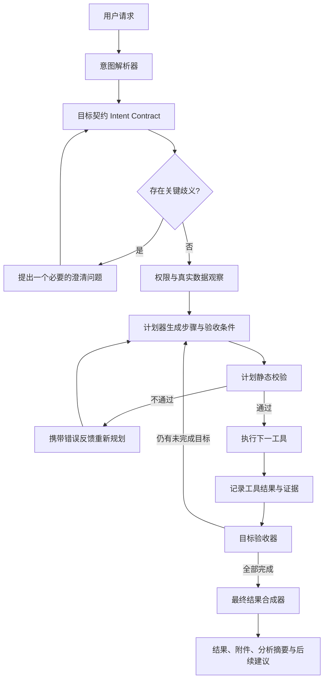

# 佳佳 Agent V2：意图理解、可审计分析与目标闭环设计方案

## 1. 目标

将佳佳从“识别一个动作并调用一个工具”升级为真正面向项目管理的领域 Agent：

1. 先理解用户要求，拆分出全部目标、对象、范围、条件和交付物。
2. 对照当前账号权限和真实项目数据确认目标范围。
3. 形成可执行计划，逐步调用工具，而不是只选择第一个看起来匹配的工具。
4. 每一步执行后验证结果是否满足对应目标；未满足时重新规划，不能提前宣布完成。
5. 在界面中持续展示可核查的分析过程，最后再输出完整结果。
6. 后续新增字段、模块或工具时，通过版本化能力目录自动被发现，不依赖把所有字段硬编码进提示词。

本方案参考 Hermes Agent 的核心循环思想：模型提出工具调用，运行时执行并返回真实结果，模型继续基于工具结果决策，直到形成最终回答；工具参数必须经过结构化校验，工具执行结果必须重新进入上下文。参考：

- [Hermes Agent](https://github.com/NousResearch/hermes-agent)
- [Hermes Agent Loop](https://github.com/NousResearch/hermes-agent/blob/main/website/docs/developer-guide/agent-loop.md)

## 2. 当前问题与代码证据

### 2.1 动作成功不等于用户目标完成

当前聊天接口只要生成了 `action`，就进入动作执行分支，并直接生成“已执行”文本，不再调用回答模型完成报告、解释或后续目标合成：

- `src/app/api/assistant/chat/route.ts:233-258`

因此“导出所有前端任务，并总结前端任务进度”虽然包含两个交付目标，系统只要导出成功就会结束。截图中的 202 条筛选已经正确，但“进度总结报告”没有成为独立、强制验收的交付物。

### 2.2 单动作规划器无法表达完整意图

当前单动作规划器只返回：

```json
{
  "toolId": "project.export",
  "args": {},
  "command": "...",
  "decisionSummary": "..."
}
```

对应代码：

- `src/lib/project-assistant-model.ts:200-258`

该结构没有以下内容：

- 用户的全部子目标；
- 每个子目标的完成条件；
- 多个交付物之间是否必须使用同一批数据；
- 哪些目标已经完成、哪些尚未完成；
- 最终回答必须包含什么。

### 2.3 工作流触发条件过于表面

当前多步骤判断主要依赖“然后、并且、同时”等连接词：

- `src/lib/project-assistant-model.ts:141-147`

这会导致：

- 有连接词不一定真的需要多个工具；
- 没有连接词也可能包含多个目标；
- “导出并报告”可能被错误压缩为一个动作；
- 计划器关注句式，而不是交付目标。

### 2.4 计划完成判定只检查步骤状态

当前计划完成条件是所有步骤状态均为 `SUCCEEDED`：

- `src/lib/assistant-plans.ts:308-327`

它没有再次对照用户原始请求检查：

- 筛选对象是否正确；
- 数量、层级和排序是否正确；
- 是否生成了所有交付物；
- 最终报告是否确实基于导出的同一批数据；
- 回答是否覆盖全部问题。

### 2.5 当前“决策过程”是日志展示，不是闭环推理

当前界面已经可以展示需求、数据观察、工具参数和规划阶段，但这些信息主要是单次规划的追踪记录：

- `src/components/project-assistant.tsx:229-301`

它缺少“目标清单 -> 当前完成度 -> 工具结果 -> 验收 -> 重新规划 -> 最终综合”的连续过程，所以用户看到有思考计时，却看不到助手如何判断所有要求是否已经完成。

## 3. 设计原则

1. **目标完整性优先**：先建立交付目标清单，任何一个必需目标未完成，都不能回复“已完成”。
2. **真实数据优先**：模型只能根据数据库查询、工具输出和使用手册形成结论，不能假设数据。
3. **选择范围只缩不扩**：模型不能擅自移除层级、类别、状态、日期、编号等限制条件。
4. **计划与执行分离**：模型负责理解和选择工具；服务端负责权限、参数、执行和验证。
5. **可恢复**：参数错误、权限不足、数据为空和工具失败都必须进入明确状态，可补充、可重试、可审计。
6. **可解释但不伪造**：展示结构化分析摘要和真实工具证据，不展示或伪造模型不可验证的内部隐藏思维链。
7. **动态能力发现**：字段、模块和工具由能力注册表提供，升级后自动进入模型上下文。

## 4. 目标架构



核心变化不是增加更长的提示词，而是引入一个服务端控制的 Agent 循环：

`理解 -> 观察 -> 计划 -> 校验 -> 执行 -> 验收 -> 重规划 -> 综合回答`

## 5. 意图契约

每次请求先生成一个不可丢失的 `IntentContractV1`。模型可以提取语义，但服务端必须完成 schema 校验和确定性补全。

```ts
type IntentContractV1 = {
  version: 1;
  originalRequest: string;
  objectives: Array<{
    id: string;
    action: "QUERY" | "ANALYZE" | "EXPORT" | "CREATE" | "UPDATE" | "DELETE";
    domain: "GANTT" | "MATTER" | "RISK" | "BUDGET" | "DOCUMENT" | "TODO";
    description: string;
    required: boolean;
    dependsOn: string[];
    completionCriteria: Array<{
      kind: string;
      expected: unknown;
    }>;
  }>;
  selection: {
    projectId: string;
    filters: Array<{
      field: string;
      operator: "EQ" | "IN" | "CONTAINS" | "BETWEEN" | "IS_NULL";
      value: unknown;
      sourceText: string;
    }>;
    sort: Array<{ field: string; direction: "ASC" | "DESC" }>;
  };
  deliverables: Array<{
    id: string;
    type: "CHAT_REPORT" | "CSV" | "XLSX" | "MPP" | "DATABASE_CHANGE";
    required: boolean;
    objectiveIds: string[];
  }>;
  ambiguities: Array<{
    field: string;
    reason: string;
    material: boolean;
  }>;
  confidence: number;
};
```

### 5.1 截图请求应形成的契约

用户请求：

> 帮我导出所有的前端任务，并且对当前前端任务进度总结出一份报告

正确的目标契约应包含：

```json
{
  "objectives": [
    {
      "id": "O1",
      "action": "EXPORT",
      "domain": "GANTT",
      "description": "导出任务类别或名称包含前端的全部任务",
      "required": true
    },
    {
      "id": "O2",
      "action": "ANALYZE",
      "domain": "GANTT",
      "description": "基于与 O1 完全相同的任务集合生成当前进度报告",
      "required": true,
      "dependsOn": ["O1"]
    }
  ],
  "selection": {
    "filters": [
      {
        "field": "taskCategoryOrName",
        "operator": "CONTAINS",
        "value": "前端",
        "sourceText": "前端任务"
      }
    ],
    "sort": [{ "field": "hierarchyPosition", "direction": "ASC" }]
  },
  "deliverables": [
    { "id": "D1", "type": "CSV", "required": true, "objectiveIds": ["O1"] },
    { "id": "D2", "type": "CHAT_REPORT", "required": true, "objectiveIds": ["O2"] }
  ]
}
```

完成条件必须是 `D1 + D2` 均已生成，而不是 `project.export` 工具返回成功。

## 6. 真实数据选择层

新增统一只读工具 `project.data.select`，它不直接返回任意数据库内容，而是根据授权范围生成一个短期 `selectionId`：

```json
{
  "selectionId": "sel_xxx",
  "domain": "GANTT",
  "projectId": "...",
  "matchedCount": 202,
  "orderedIds": ["..."],
  "fingerprint": "sha256(...)",
  "summary": {
    "categories": {},
    "depths": {},
    "progress": {}
  },
  "expiresAt": "..."
}
```

要求：

- `selectionId` 与用户、项目、权限、筛选条件和数据版本绑定；
- 导出和分析必须引用同一个 `selectionId`；
- 数据变化后 fingerprint 不一致时，重新选择并在轨迹中说明；
- 不能由模型直接提供数据库主键列表绕过权限；
- 默认保持系统原始层级顺序。

这样可以保证“导出的 202 条任务”和“报告分析的 202 条任务”完全一致。

## 7. Planner、Executor、Verifier 循环

### 7.1 Planner 输出

规划器不再只输出一个工具，而是输出一个受限计划：

```json
{
  "goalSummary": "筛选前端任务，导出文件并生成同范围进度报告",
  "steps": [
    {
      "id": "S1",
      "toolId": "project.data.select",
      "objectiveIds": ["O1", "O2"],
      "args": { "domain": "GANTT", "filters": [] },
      "successCriteria": ["matchedCount >= 0", "selectionId exists"]
    },
    {
      "id": "S2",
      "toolId": "project.export",
      "objectiveIds": ["O1"],
      "dependsOn": ["S1"],
      "args": { "selectionId": "$S1.selectionId", "format": "CSV" },
      "successCriteria": ["downloadUrl exists", "exportedCount == $S1.matchedCount"]
    },
    {
      "id": "S3",
      "toolId": "project.progress.report",
      "objectiveIds": ["O2"],
      "dependsOn": ["S1"],
      "args": { "selectionId": "$S1.selectionId" },
      "successCriteria": ["report exists", "analyzedCount == $S1.matchedCount"]
    }
  ]
}
```

### 7.2 服务端静态校验

执行前必须检查：

1. 所有 `required objective` 至少被一个步骤覆盖；
2. 所有 `required deliverable` 有生成步骤；
3. 工具在当前版本启用；
4. 当前用户有工具权限和项目访问权限；
5. 参数通过 JSON Schema；
6. 依赖关系无环；
7. 写操作风险级别符合“请求批准 / 替我审批 / 完全访问”；
8. 计划没有扩大用户筛选范围；
9. 最大步骤数、最大工具调用数和运行时间未超限。

### 7.3 执行循环

```ts
while (!goalVerifier.allRequiredObjectivesPassed()) {
  const step = planner.nextStep(state);
  validatePlanStep(step, intentContract, capabilityRegistry, userPermissions);
  const result = await toolExecutor.execute(step);
  state.appendToolResult(result);
  goalVerifier.evaluate(result, intentContract);

  if (result.failed || goalVerifier.detectedGap()) {
    planner.replan({ state, validationFeedback: goalVerifier.feedback() });
  }
}
```

边界：

- 最大循环 8 次；
- 最大工具调用 10 次；
- 同一失败参数不得重复超过 2 次；
- 只允许暂时性错误自动重试；
- 数据为空不是错误，必须明确回答“当前筛选命中 0 条”；
- 缺少会改变结果的关键条件时只问一个澄清问题；
- 达到上限仍未完成时必须报告未完成目标，不能伪装成功。

## 8. 目标验收器

新增 `AssistantGoalVerifier`，验收对象不是工具，而是用户目标。

```ts
type ObjectiveVerification = {
  objectiveId: string;
  status: "PENDING" | "PASSED" | "FAILED" | "NEEDS_INPUT";
  evidence: Array<{
    source: "DATABASE" | "TOOL_RESULT" | "PERMISSION" | "USER_INPUT";
    reference: string;
    value: unknown;
  }>;
  explanation: string;
};
```

截图请求的验收规则：

- O1：下载地址存在；导出数量等于 selection 数量；导出顺序保持原始层级；
- O2：报告存在；报告分析数量等于 selection 数量；报告至少包含总数、完成、进行中、未开始、逾期、平均进度和主要偏差；
- 最终：O1、O2 均为 `PASSED`。

## 9. “思考过程”展示设计

### 9.1 展示目标

用户体验应明确呈现“佳佳先分析，再执行，最后回答”，但展示内容必须来自结构化状态和真实证据，而不是伪造一段无法校验的内部独白。

建议将当前“决策过程与数据依据”升级为实时 `AgentTraceEvent` 流：

```ts
type AgentTraceEvent = {
  id: string;
  at: string;
  phase:
    | "UNDERSTAND"
    | "CLARIFY"
    | "OBSERVE"
    | "PLAN"
    | "VALIDATE"
    | "EXECUTE"
    | "VERIFY"
    | "REPLAN"
    | "SYNTHESIZE";
  title: string;
  summary: string;
  evidence?: Array<{ label: string; value: string }>;
  status: "RUNNING" | "SUCCEEDED" | "FAILED";
};
```

### 9.2 截图请求应显示的过程

1. **理解需求**：识别到两个必要目标：导出前端任务、生成同范围进度报告。
2. **确认范围**：在当前项目任务类别和任务名称中匹配“前端”，命中 202 条；保持原始层级顺序。
3. **制定计划**：同一数据选择用于导出和分析，避免两个结果范围不一致。
4. **执行导出**：生成 CSV，导出 202 条，下载地址校验通过。
5. **分析进度**：统计 202 条任务的完成、进行中、未开始、逾期和平均进度。
6. **验证目标**：导出文件和进度报告均已生成，分析数量与导出数量一致。
7. **生成回答**：先给进度结论，再提供下载按钮和数据依据。

这些内容是可公开、可复查的分析摘要。不得把模型内部原始 token、隐藏提示词、系统提示词或未验证的自由联想显示给用户。

### 9.3 实时交互

将聊天接口逐步升级为 SSE/流式响应：

- `trace.started`
- `trace.updated`
- `tool.started`
- `tool.completed`
- `verification.completed`
- `answer.delta`
- `answer.completed`
- `run.failed`

前端默认展开当前正在运行的分析过程；最终回答完成后自动折叠，但用户可再次展开查看完整依据。停止按钮中止后续工具调用，但保留已经完成的轨迹和结果。

## 10. 最终回答合成器

当前动作成功分支不能直接结束。所有工具完成后，必须调用独立的 `FinalAnswerComposer`，输入仅包含：

- 原始请求；
- 已验证的意图契约；
- 目标验收结果；
- 工具结构化输出；
- 允许公开的数据摘要；
- 下载文件元数据；
- 使用手册和当前能力边界。

最终回答模板：

1. **结论**：直接回答用户问题；
2. **分析结果**：报告数据和主要发现；
3. **交付物**：下载文件、记录数量、格式；
4. **数据范围**：项目、筛选条件、数据时间；
5. **未完成项**：若有，明确说明原因和所需补充；
6. **下一步建议**：仅基于当前结果动态生成。

模型不能把工具成功改写成目标成功；最终合成前必须读取 `AssistantGoalVerifier` 的结果。

## 11. 权限与安全

1. 意图理解阶段不授予任何额外权限；
2. 数据选择阶段按当前用户项目权限和字段权限裁剪；
3. 每个工具执行前再次检查权限，不能只在计划生成时检查；
4. `REQUEST_APPROVAL`：所有写操作逐步确认；
5. `AUTO_APPROVE`：仅低风险和白名单中风险动作自动执行；
6. `FULL_ACCESS`：仍受账号权限、项目权限、工具白名单和参数 schema 限制；
7. 删除、批量修改等高风险动作必须展示影响数量、对象范围和不可逆风险；
8. 所有计划、参数、确认人、执行结果和失败原因写入操作日志。

## 12. 升级与动态能力发现

### 12.1 版本化能力注册表

每个模块暴露标准能力描述：

```ts
type AssistantCapability = {
  id: string;
  version: number;
  domain: string;
  description: string;
  operations: string[];
  queryableFields: Array<{
    name: string;
    type: string;
    aliases: string[];
    sensitive: boolean;
  }>;
  tools: string[];
  permissions: string[];
};
```

新增字段或模块时：

1. Prisma schema 和业务模块提供字段元数据；
2. 能力注册表过滤敏感字段后生成模型可见快照；
3. 工具目录注册可执行操作；
4. 能力版本变化使旧计划失效并重新规划；
5. 未注册执行器的字段只能查询和解释，不能假装可以修改。

### 12.2 兼容策略

- `AssistantPlanRun.inputJson` 存储 `IntentContractV1`，暂不强制新增数据库列；
- `AssistantPlanRun.traceJson` 存储结构化事件；
- `AssistantPlanStep.inputJson/outputJson/verificationJson` 存储步骤契约和证据；
- JSON 均带 `version`，后续通过适配器读取旧版本；
- 已执行动作继续保留原 `toolVersion`，新版本工具不得改变旧动作语义；
- 数据库迁移必须前向兼容，不能以清库或删除旧 JSON 为升级手段。

## 13. 代码改造范围

### 13.1 新增模块

- `src/lib/assistant-intent-contract.ts`：意图契约、schema 校验和约束保真检查；
- `src/lib/assistant-selection-service.ts`：统一授权数据选择和 selection fingerprint；
- `src/lib/assistant-agent-runtime.ts`：Agent 循环、预算、状态迁移和中止；
- `src/lib/assistant-goal-verifier.ts`：按用户目标验收；
- `src/lib/assistant-final-answer.ts`：基于已验证证据生成最终回答；
- `src/lib/assistant-trace-events.ts`：可公开分析事件及脱敏；
- `src/app/api/assistant/chat/stream/route.ts`：SSE 事件流。

### 13.2 重构模块

- `src/lib/project-assistant-model.ts`：从单工具规划改为意图解析、计划生成和最终合成三个独立模型调用；
- `src/lib/project-assistant-agent.ts`：改为运行 Agent 循环，不在第一个 action 生成后返回；
- `src/lib/assistant-plans.ts`：从“所有步骤成功”升级为“所有必需目标验收通过”；
- `src/lib/assistant-actions.ts`：工具只负责执行，不负责决定用户目标是否完成；
- `src/app/api/assistant/chat/route.ts`：动作执行后继续完成验收和最终回答；
- `src/components/project-assistant.tsx`：实时展示分析过程、目标状态、工具结果和最终回答。

## 14. 实施阶段

### 阶段一：意图契约与验收闭环

- 引入 `IntentContractV1`；
- 将每次请求拆成目标和交付物；
- 动作执行后运行目标验收；
- 修复“完成一个动作就提前结束”的问题；
- 暂时沿用现有非流式接口。

### 阶段二：统一数据选择与组合工具

- 新增 `project.data.select`；
- 拆分 `project.export` 和 `project.progress.report`；
- 多个步骤共享 selectionId；
- 统一层级、排序、筛选和数量校验。

### 阶段三：实时分析过程

- 增加 SSE 流；
- 前端实时显示理解、观察、计划、执行、验证和重规划；
- 最终回答后自动折叠；
- 支持停止并保留已完成证据。

### 阶段四：动态能力与升级兼容

- 模块能力自动注册；
- 字段元数据动态发现；
- 工具版本和计划版本兼容；
- 管理后台增加能力诊断页面。

### 阶段五：评测与灰度

- 建立中文项目管理 Agent 评测集；
- 先在管理员账号灰度；
- 达到指标后再默认启用；
- 保留 V1 快速回退开关。

## 15. 验收标准

### 15.1 功能验收

1. 截图原句必须识别出 `EXPORT + ANALYZE` 两个必要目标；
2. 导出和报告必须使用同一个 selectionId；
3. 最终回答必须同时出现进度总结和下载入口；
4. 任一必要目标未完成时不得显示“已完成”；
5. “只导出 1、2、3 级任务”不能导出其他层级；
6. “导出紧急事项并总结负责人分布”必须同时完成筛选导出和分布分析；
7. 命中 0 条时不得放宽条件；
8. 用户无权限时不得泄露数量、名称或文件；
9. 中止请求后不得继续调用新工具；
10. 重新登录后可查看历史结果，但不能恢复已中止运行的内部执行循环。

### 15.2 质量指标

- 意图目标召回率：>= 98%；
- 筛选条件保真率：100%；
- 必需交付物完成率：>= 99%；
- 未授权工具执行数：0；
- 目标未完成但宣称成功：0；
- 相同 selection 的导出/报告数量一致率：100%；
- 结构化分析事件来源可追溯率：100%。

### 15.3 测试层级

- 单元测试：意图契约、条件保真、计划校验、目标验收、事件脱敏；
- 集成测试：模型计划 -> 工具执行 -> 结果回填 -> 重规划 -> 最终合成；
- API 测试：权限模式、中止、超时、空数据、工具失败和续跑；
- E2E：截图原句、层级筛选、类别筛选、多目标、澄清问题和下载；
- 回归测试：现有待办、风险、甘特修改、附件转换和聊天历史；
- 可观测性：每个运行记录目标数、工具数、重规划数、验收状态和耗时。

## 16. 关键决策

### 采用

- 目标契约驱动，而不是连接词驱动；
- 服务端 Agent 循环，而不是一次模型调用；
- 结构化、可审计的分析摘要，而不是伪造自由文本思维链；
- 同一 selectionId 保证导出和分析口径一致；
- 目标验收决定是否完成，而不是工具状态决定；
- 版本化能力注册表支持后续模块和字段升级。

### 不采用

- 单纯增加 system prompt：不能解决提前结束、权限、验证和升级兼容；
- 把所有工作塞进 `project.export`：会继续混淆导出和分析两个目标；
- 展示模型原始隐藏思维：不可验证，可能泄露系统提示词和敏感上下文；
- 开放通用 SQL/Shell：不符合项目权限和数据安全要求；
- 命中 0 条时自动扩大范围：会违背用户条件并产生错误结果。

## 17. 推荐实施顺序

优先实施阶段一和阶段二。它们直接解决当前“听懂一半、执行一半、提前结束”的问题，也是后续实时思考展示的真实数据基础。阶段三只负责把已经真实发生的过程流式展示出来，不能先做动画再补执行闭环。
