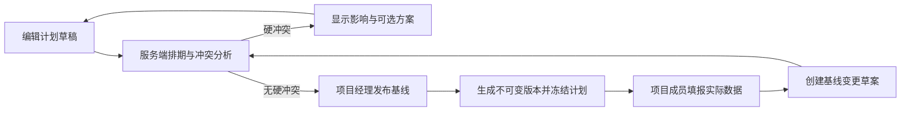

# WBS 排期与基线实施方案

> **状态：历史设计记录，非当前运行规则。** 当前系统只保留一套会修改未完成叶子任务计划日期的“正式自动排期”，其权威定义见 [ADR 0003](./adr/0003-resource-constrained-wbs-scheduling.md) 与 [WBS 排期逻辑梳理与精简记录](./WBS排期逻辑梳理与精简记录.md)。普通编辑、导入、负责人或实际数据更新只刷新父级汇总、实际汇总、浮动、关键路径和派生优先级，不再执行叶子任务的普通重排。本文件中关于多候选方案、局部受影响重排及自动落库的旧表述仅保留作历史背景。

## 目标

将项目 WBS 从“填写日期的任务清单”升级为可解释、可回溯的排期系统：计划、资源、依赖、边界、实际进展和基线必须使用同一套服务端规则。

## 已确认业务规则

| 主题 | 规则 |
| --- | --- |
| 日历 | 项目统一使用自然日或中国工作日历；工作日含法定节假日与调休。一天 7.5 小时，拆为 `↑`、`↓` 两个 3.75 小时时段。 |
| 工期 | 最小 0.5 天；预计工时由工期乘 7.5 自动得出，实际工时单独录入且保留两位小数。 |
| 排期方式 | 自动排程、工期固定正排、工期固定倒排、日期固定。仅自动排程可由系统直接移动。 |
| 依赖 | 本期只接受 FS 和非负半日时差。完成任务的实际完成时间继续作为未开始紧后任务的时间约束。 |
| 负责人 | 叶子任务仅一名直接负责人；不同负责人可并行。父任务负责人只展示后代汇总。 |
| 优先级 | 关键路径为“最高”只读；有依赖但非关键路径为“高”只读；其他叶子任务可选低、中、高。 |
| 父级 | 默认按后代任务汇总日期；用户设定的父级日期成为硬边界，子任务不得静默越界。 |
| 基线 | 发布前可编辑；发布后仅可填实际数据。所有计划与结构变更走单一活动草案、预览、项目经理发布、新版本。 |
| 风险 | 完整性错误禁止保存；硬边界/FS 冲突可存草案但禁止发布；容量与目标日期偏差可由项目经理带理由确认发布。 |

## 排期算法

1. 校验任务树、负责人、工期粒度、日期格式、FS 依赖图和实际日期；循环依赖、未来实际完成等完整性错误直接拒绝。
2. 将已完成叶子任务从资源占用集合排除；以其实际完成时间替代计划完成时间计算紧后约束。
3. 生成当前变动的受影响排期集合：当前任务、未完成紧后链、共享负责人且有容量竞争的本项目未完成叶子，以及这些任务的紧后链。其他项目任务只占容量，不被移动。
4. 先满足不可移动任务和父级/项目硬边界；自动任务按依赖就绪时间、有效优先级、原 WBS 顺序安排。没有紧前关系时使用父级完成边界或项目目标倒排；无任何锚点则保持未排期并明确提示。
5. 按半日槽检测同一负责人容量。资源平滑只使用任务浮动；资源平衡可延长项目完成时间。两者均返回候选方案而不自动落库。
6. 根据最终日期计算最早/最晚时间、总/自由浮动、关键路径与资源关键链；父任务再按后代结果汇总。

## 发布与变更流程

## 实施顺序与验收

1. **模型与迁移**：新增结构化的任务计划方式、用户/有效优先级、项目硬边界、日历版本、基线版本及草案模型；历史数据可读且不丢失。
2. **排期内核**：实现半日 FS、父级边界、完成任务实际日期、优先级、资源容量、关键路径与资源链计算，并提供纯函数测试。
3. **服务端写入闭环**：所有任务编辑、层级调整、依赖修改、导入、自动排期及基线发布通过同一校验与影响预览。
4. **界面与权限**：展示计算方式、冲突、影响、候选方案、基线版本/差异和通知；草案权限与项目经理发布权限独立验证。
5. **回归验证**：覆盖工作日、半日、FS、多紧前、父级硬边界、资源冲突、完成/重开、基线冻结与历史兼容场景。

## 不在本期

- SS、FF、SF、负时差。
- 任务拆分、暂停后剩余工时重排、个人请假日历。
- 多人实时协同编辑同一基线草案。
