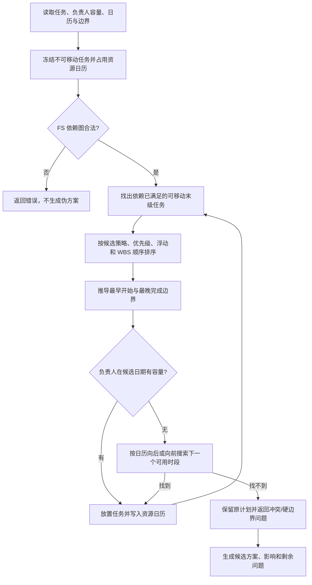
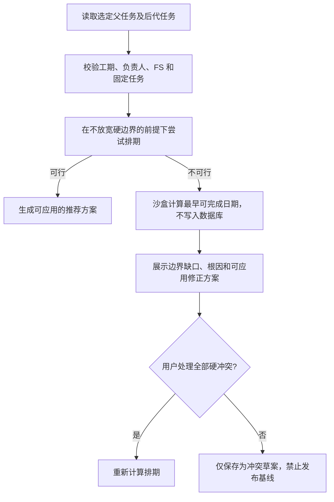

# WBS 排期逻辑梳理与精简记录

## 使用方式

本文件记录项目经理针对 WBS 排期功能提出的问题、当前系统的实际行为、确认后的精简决定，以及后续实施结果。

约定：

- `当前实现` 只描述已上线代码的实际行为。
- `待确认` 是尚未形成产品决定的内容，不作为已实现功能。
- `已确认` 的规则在实施后补充变更范围与验证结果。

## 2026-08-13 实施决议：只保留正式自动排期

本节覆盖本文此前关于“最少改动、最早完成、按期优先、资源平滑”等多候选方案和“普通重算会移动叶子任务”的历史描述；这些内容保留为决策过程记录，不再是系统行为。

### 触发边界

1. 只有用户显式点击 WBS 的“自动排期”，或确认智能助手生成的正式排期提案时，系统才允许改变未开始末级任务的计划日期。
2. 新增、编辑、导入、负责人变更、依赖修改后的普通刷新，只更新父级汇总、CPM、浮动、关键路径、派生优先级和风险提示，不改写叶子任务计划日期、工期、预计工时或负责人。
3. 自动排期先预览，用户确认后应用；预览绑定 WBS 修订号和输入快照，期间任何数据变化都会使预览过期。

### 正式算法

1. 以项目 T0 为正排起点，以工作日历、FS 紧前关系、锁定父级边界和项目硬完成日期建立末级执行网络。父任务 `ROLLUP` 日期只反映子任务结果，不能反过来充当叶子任务的隐含排期起点。
2. 首次 CPM 计算忽略人员容量，用于得到总浮动、下游解锁工作量和初始关键路径。
3. 末级自动任务按照“总浮动小 -> 下游影响大 -> 业务优先级高 -> WBS 顺序”排序；同一负责人串行，不同负责人可并行。已完成、进行中、日期固定和范围外任务均作为不可移动占用。
4. 资源分配后的日期再次进入 CPM，得到最终关键路径、总浮动和资源关键链。任务可出现不连续的占用窗口；父级工作量按各负责人串行链和依赖链的最大占用计算，而非简单按日历跨度累加。
5. `LOCKED` 父级和项目硬完成日是不可穿透的硬约束；`TARGET` 父级和项目目标完成日是预警，不允许通过虚构日期掩盖风险。缺少正式工期、唯一负责人、锚点，或存在循环依赖、硬边界冲突时，正式排期不生成可应用的部分结果。

### 当前范围

- 仅支持 FS（完成-开始）关系。
- 工期建议只能作为待应用建议；未确认的工期不会进入正式排期。
- 正式排期不会静默更换负责人、压缩工期、删除依赖或扩大硬边界。
- 历史代码中名为 `recalculateProjectGanttSchedule` 的兼容入口现在只刷新派生状态，不执行叶子日期重排。

---

## 问题 1：当前“确认手动排期影响”弹窗的触发逻辑和内容是什么？

### 当前实现

该弹窗是对**单个任务的手动排期字段修改**进行预览确认的保护层。它不是每次保存都会弹出，也不应在单独修改负责人、任务名称、描述、备注、实际数据时弹出。

#### 前端触发范围

当前仅当用户编辑下列字段之一时，前端先请求“影响预览”，而不立即保存：

1. 计划开始日期。
2. 计划完成日期。
3. 工期。
4. 优先级。
5. 紧前任务（FS 依赖）。

前端会根据当前输入临时推导任务排期方式：

- 输入开始日期和工期：工期固定正排。
- 输入完成日期和工期：工期固定倒排。
- 同时输入开始、完成日期：日期固定。
- 未形成完整条件：保持自动排期。

若编辑的是父任务的上述计划字段，且原本为“自动汇总子任务”，系统会把父任务切换为“锁定边界”，以避免之后的汇总覆盖用户手工设定的父级时间窗口。

#### 服务端预览计算范围

服务端不会在预览阶段写入数据库。它在内存中应用这次变更后，收集下列可能受影响的任务：

1. 当前任务。
2. 当前任务修改前和修改后的紧前任务。
3. 当前任务的所有父级任务。
4. 上述任务的全部紧后任务链。
5. 当前任务的全部子孙任务。

随后基于临时排期，检测：

1. 父级日期边界、项目完成边界等排期约束。
2. FS 依赖是否满足。
3. 工期或开始日期是否缺失。
4. 同一负责人在同一时段的容量或并发冲突。

#### 弹窗出现的条件

只要符合以下任意一项，就会弹出确认框：

1. 受影响任务数大于 1。
2. 存在排期约束问题或警告。
3. 存在负责人容量或并发冲突。

因此，即使没有真正的冲突，只要本次修改会影响父级、子级或紧后任务，当前版本也会要求确认。

### 弹窗显示内容

弹窗标题为“确认手动排期影响”，说明文字承诺两件事：保留用户手工输入的日期；不直接替换用户日期，但会以紧前关系重新计算后续自动任务，并保留冲突提示。

弹窗正文最多包含三类信息：

1. **可能受影响的后续任务**：最多显示 8 条任务 ID 和名称，超出则显示剩余数量。
2. **排期约束**：最多显示 6 条问题，每条包含问题描述和调整建议。
3. **负责人容量或并发冲突**：最多显示 6 条冲突时段，并标明“容量超限”或“并发超限”。

底部有两个结果：

- `取消修改`：丢弃本次编辑，重新拉取当前任务数据。
- `仍按此日期保存`：按用户输入直接保存；保存后会重新计算项目排期，并可能继续显示“固定排期干涉提醒”。

### 例子

例如：任务 A 是任务 B 的紧前任务。将 A 的计划完成从 8 月 3 日改为 8 月 8 日时，A、B、B 的紧后链以及 A 的父级都会进入影响范围。即使 B 还没有实际被系统改期，只要影响范围大于一个任务，当前版本也会弹出确认框。

### 当前实现的可用性问题

当前触发条件偏宽：`影响任务数大于 1` 就弹窗，使得正常的日期、工期、优先级或紧前关系编辑也经常被中断。它把“需要知情”与“必须确认”混在了一起，是后续精简时应优先拆开的逻辑。

### 相关代码

- 前端触发和保存：`src/components/project-gantt-panel.tsx`。
- 弹窗渲染：`src/components/project-gantt-panel.tsx`。
- 服务端预览接口：`src/app/api/projects/[id]/gantt-tasks/[taskId]/route.ts`。
- 影响范围与冲突分析：`src/lib/gantt-resource-service.ts`。

### 我的精简建议（未实施）

将“影响范围”与“必须确认”分开处理，避免正常录入日期、工期和优先级时被频繁打断。

| 情况 | 建议交互 | 是否阻断保存 |
| --- | --- | --- |
| 仅影响当前任务的 CPM、父级汇总或紧后链，但不移动其他任务且无冲突 | 直接保存，显示短时提示“已更新，影响 X 项计算结果” | 否 |
| 修改优先级，但尚未执行自动排期 | 直接保存，并标记“自动排期建议需要重新计算” | 否 |
| 自动任务将被系统改期 | 显示“排期影响预览”，列出将移动的任务、前后日期和原因 | 是，需要用户应用方案 |
| 引入负责人容量冲突、目标日期偏差 | 显示警告，可保存为草案；草案标记为不可发布 | 不阻断草案，阻断基线发布 |
| 循环依赖、无效紧前任务、锁定父级边界或项目硬完成边界被突破 | 显示错误和可应用的修正方案 | 是 |

具体建议如下：

1. 删除“受影响任务数大于 1 就弹窗”的单独触发条件。受影响任务多并不代表用户需要逐次确认。
2. 优先级字段本身不弹窗。它只改变下一次自动排期时的同级任务先后，不应被当作立即改期。
3. 将当前的“仍按此日期保存”改成更明确的动作：`保存草案`、`应用建议排期`、`返回修改`。用户应当知道是否会移动其他任务。
4. 对可保存但不可发布的冲突，在 WBS 顶部保留持续状态条；不要只在一次弹窗后消失。
5. 弹窗只展示确实会变动的任务及变动原因，不再把纯汇总父任务与未变动后续任务混入“将修改”清单。

---

## 问题 2：自动排期的具体算法是什么？负责人、优先级、紧前任务和固定时间如何共同处理？不考虑优先级是否会显著降低复杂度？

### 结论先行

当前系统的自动排期并不是穷举所有组合以证明“数学全局最优”的求解器，而是一个**先满足硬约束、再按排序规则逐个放置任务的启发式排程器**。它能给出可解释的候选方案，但在负责人、依赖、日期固定任务都很多时，不能保证找到所有可能排法中的绝对最优解。

不考虑优先级**不会显著降低算法复杂度**。优先级只是同一时刻多个可排任务之间的排序规则，增加的是比较与排序中的一个常数级判断；真正耗时的是逐日寻找负责人可用容量、反复处理依赖就绪队列，以及当前一次生成四种候选方案。取消优先级会降低业务表达能力，却不会解决主要性能问题。

### 当前实现：输入、范围与不可移动任务

自动排期启动后，服务端会读取：

1. 当前项目的所有 WBS 任务、父子关系、工期、计划日期、排期方式、优先级、实际进度和 FS 紧前关系。
2. 当前项目组成员的每日容量、效率、并发上限，以及任务负责人分配。
3. 其他未作废项目中相同负责人的已排任务。它们只占用负责人容量，不会被当前项目的排期操作移动。
4. 项目日历模式、项目硬完成时间、项目目标完成时间、父级日期边界，以及 CPM 计算出的最晚完成时间和浮动。

用户选择排期范围时，系统只会修改所选父任务分支下的**末级任务**；范围外任务仍作为既有资源占用保留。若不选择范围，则分析全项目的末级任务。

下列任务不会被自动移动，而会先写入负责人容量日历，成为其他任务必须避开的占用：

1. 日期固定、工期固定正排、工期固定倒排的任务。
2. 已经开始或已有进度的任务。
3. 非末级任务。
4. 其他项目的任务。
5. 本次自动排期范围外的任务。

只有“当前项目 + 末级 + 未开始 + 自动排期 + 工期大于 0”的任务，才是本次可移动对象。

### 当前实现：前置校验

在生成方案前，系统先做以下校验：

1. **依赖图校验**：只支持完成-开始（FS）关系；非 FS、无效紧前任务或循环依赖会产生错误，自动排期停止，不会凭空选一个顺序继续排。
2. **负责人校验**：当前规则要求参与自动排期的末级任务恰好有一名负责人；缺失负责人或遗留的多人分配都不能自动排期。
3. **工期与锚点校验**：任务必须有正工期，并至少具有一个排期锚点。正排锚点可以是计划开始、紧前任务完成、父级边界或项目边界；倒排锚点可以是计划完成、紧后任务开始、父级完成边界或项目硬完成时间。
4. **父级边界校验**：父任务为“锁定边界”时，子任务不得早于父级开始或晚于父级完成；父任务为“目标边界”时越界只产生警告；父任务为“自动汇总”时，日期仅可作为未排期子任务的初始种子，不构成硬约束。

### 当前实现：排期决策顺序

可以把当前单次候选方案的计算理解为下面的流程：



详细规则如下：

1. **先冻结约束**：所有不可移动任务先占用其负责人的每个工作日容量。不同负责人没有共同资源键时可并行；同一负责人在同一天的分配工时不得超过其可用容量，也不得超过其并发上限。
2. **再按 FS 拓扑顺序处理**：正排时，只有所有紧前任务已经排定的任务才“就绪”；倒排时，只有所有紧后任务已经排定的任务才“就绪”。多个紧前任务时，取其中最晚允许开始日。
3. **计算日期窗口**：最早开始取“任务已有开始、最晚紧前完成后的开始、锁定父级开始边界”中的最晚值；最晚完成取“锁定父级完成、项目硬完成、紧后任务反推的完成上限、CPM 最晚完成”等中的最早值。目标边界只作为偏好，不会压过 FS 关系。
4. **负责人容量搜索**：正排从最早可开始日逐日向后试放；倒排从最晚可完成日逐日向前试放。每一次试放都会检查该任务负责人每天的工时容量和最大并行任务数。工作日模式遵循项目日历，自然日模式连续计日。
5. **放不下时不伪造结果**：若无法在锁定父级或项目硬完成边界内找到可用容量，系统保留原日期，并返回“父级边界违反”“项目硬完成违反”或“资源容量不足”等问题。循环依赖、无负责人、无排期锚点属于错误，不生成可应用方案。

### 优先级在当前算法中的作用

优先级只用于“两个或多个任务都已满足依赖、都可以被选择时，谁先占用资源”的决策，不会突破 FS、锁定日期或硬边界。

系统会生成四种候选方案；它们使用相同的硬约束与资源容量检查，但排序目标不同：

| 候选方案 | 优先排序规则 | 适用目的 |
| --- | --- | --- |
| 最少改动 | 原计划开始时间 -> 优先级 -> WBS 顺序 | 尽量不改变现有日期，只在无法满足资源或依赖时挪动 |
| 最早完成 | 关键链剩余长度 -> 优先级 -> 原计划开始 -> WBS 顺序 | 尽量缩短项目总工期 |
| 按期优先 | 计划完成更早 -> 浮动更小 -> 优先级 -> WBS 顺序 | 保护临近完成节点，降低延期风险 |
| 资源平滑 | 浮动更小 -> 优先级 -> WBS 顺序 | 只在既有总工期和任务浮动内挪动，不延长项目完成时间 |

对于“无开始日期、无紧前关系、但父级有完成边界”的子任务，系统会采用倒排种子。此时会先安放低优先级任务，使高优先级任务获得更早完成的时段；这一点的业务含义是“高优先级先完成”，而不是“高优先级必须贴近父级完成日期”。

### 典型干涉如何处理

假设父任务的锁定窗口为 7 月 1 日至 7 月 10 日：

| 情况 | 当前系统处理 |
| --- | --- |
| A、B 是同一负责人且没有依赖 | 按候选方案排序后依次占用该负责人的日容量；无法并行时后一个任务向后或向前寻找空档。 |
| A、B 是不同负责人且没有依赖 | 两者可并行，除非父级边界、项目硬完成或其他依赖限制了日期。 |
| C 依赖 A 完成（FS） | C 的最早开始不得早于 A 完成后的下一个可工作时段；C 自己的负责人容量仍要单独满足。 |
| D 日期固定在 7 月 4 日至 5 日 | D 不移动，但占用其负责人的容量；可移动任务必须避开这两天。 |
| 所有任务无法在 7 月 10 日前排完 | 返回父级锁定边界或项目硬完成冲突；系统不应静默突破该边界。 |
| 父任务只是“目标边界”而非锁定 | 可以给出超出目标的方案，但要产生目标偏差警告。 |

### 当前实现的不足与潜在逻辑冲突

1. **并非全局最优**：当前算法是贪心式逐个放置。先放哪个任务会影响后续可行空间，因此在复杂资源网络中，可能存在比当前候选更优的排法。
2. **一次计算四套候选，界面负担较重**：四种方案对普通用户难以区分，也使每次分析重复执行完整排程。
3. **残留资源冲突不一定阻止“应用方案”**：当前候选是否可应用只检查是否存在错误和是否有日期变化，并不要求剩余容量警告为零。它适合“先保存草案”，但必须明确禁止带冲突发布基线。
4. **负责人规则存在历史兼容边界**：资源计算底层仍可读取多负责人分配，但当前自动排期前置校验要求末级任务唯一负责人。应统一为“末级唯一负责人，父任务汇总负责人”，避免用户看到两套相互矛盾的行为。
5. **父级边界的含义过多**：自动汇总、目标窗口、锁定窗口同时暴露，会增加理解成本。用户日常排期只需要清楚区分“汇总显示”“可超出但提醒”“绝不能超出”三种结果。
6. **浮动可能被过度当作硬约束**：当前排程在计算最晚完成上限时会纳入 CPM 的 `lateFinishDate`。这会让“最晚完成”在多数候选中表现得像硬边界；资源冲突本可通过消耗浮动或延长项目来解决时，可能被过早判定为无可用位置。

### 复杂度：取消优先级是否值得？

设 `N` 为参与排期的任务数，`E` 为 FS 依赖数，`D` 为每个任务为寻找空档而尝试的日期数，`A` 为负责人分配数。当前系统一次会计算 4 个候选方案。

1. 依赖拓扑校验约为 `O(N + E)`。
2. 当前贪心循环会重复扫描待排任务并排序，最坏情况约为 `O(N^2 log N)`，还会叠加对依赖的重复检查。
3. 每个可移动任务需要逐日寻找负责人容量，近似为 `O(N * D * A)`；实际成本还受任务工期、同日已有任务数影响。
4. 四个候选方案会将上述主要成本近似放大四倍。

优先级只是排序比较中的一个字段。即使完全删除它，依赖图、资源容量逐日搜索和四套候选计算仍然存在，复杂度阶数不会改变。对 80 条以内 WBS，保留优先级的性能成本通常可以忽略；对数百条任务，真正应优化的是候选方案数量、范围和资源日历查询，而不是删除优先级。

### 我的建议（未实施）

建议保留优先级，但将自动排期改成更容易理解的“单一推荐方案 + 必要时才展开备选方案”。

1. **固定目标顺序**：先保证数据合法和硬边界，再满足 FS，再消除同负责人容量冲突，再让高优先级尽早完成，最后才尽量少改原计划。优先级永远不能覆盖硬约束。
2. **默认只展示一个推荐方案**：常规用户点击“自动排期”后只看“推荐排期、变动任务、剩余问题、预计完成”。“最少改动 / 最早完成 / 资源平滑”放入高级选项，避免四张方案卡造成决策负担。
3. **先给出可执行的解决动作**：冲突不只显示提示，应提供可选择的动作，例如“应用推荐日期”“改为目标边界”“提高负责人可用容量”“改为草案并禁止发布”。系统不能替用户无提示地改变固定任务。
4. **优先级仅在资源争用时生效**：不存在共同负责人、共同硬边界或共同依赖窗口时，不因为优先级强行串行本可并行的任务。
5. **把“排期方式”收敛为两层**：普通界面只展示“自动排期 / 固定日期”；“工期固定正排、工期固定倒排”作为固定日期的高级计算方式，避免用户在每行理解四种模式。
6. **正确使用浮动**：将 `lateFinishDate` 作为“按期优先”和“资源平滑”的强排序或移动限额，而不是“最少改动 / 最早完成”中的默认硬上限；真正的硬上限仍只来自锁定父级和项目硬完成日期。
7. **性能优化顺序**：先限制分析范围到选定父任务的叶子节点；其次默认只计算推荐方案；再复用负责人日历和依赖拓扑，并用优先队列维护就绪任务；最后才考虑更复杂的全局优化求解器。不要为了性能删除优先级。

### 相关代码与证据

- 自动排期范围、弹窗和应用操作：`src/components/project-gantt-panel.tsx`。
- 自动排期接口与版本/快照校验：`src/app/api/projects/[id]/gantt-tasks/resource-schedule/route.ts`。
- 跨项目负责人容量、范围解析与落库：`src/lib/gantt-resource-service.ts`。
- FS 拓扑、父级边界、资源容量、逐日搜索和候选方案：`src/lib/gantt-resource-schedule.ts`。
- 关键路径、最早/最晚日期和浮动计算：`src/lib/gantt-cpm.ts`。

---

## 问题 3：自动排期是所有任务一起排，还是只影响下一级？跨分支依赖和父任务工期如何处理？

### 结论先行

自动排期需要区分两个概念，当前界面没有明确说明，容易造成误解：

1. **计算上下文**：系统会读取当前项目的全部任务、全部 FS 依赖和全部负责人资源占用；另外也会读取其他未作废项目中相同负责人的任务作为容量占用。
2. **允许修改的范围**：系统只修改用户所选父任务范围下的、符合条件的末级任务。它不会只排“下一层”，而是递归找到该范围内的所有末级任务；但范围外任务即使是自动任务，也会在本次计算中视为日期固定，不会被移动。

因此，对父任务 A 点击自动排期后，若把 A 的全部可选范围都纳入，A 下的 1、2、3 三个分支的所有末级任务会作为**同一张依赖网络**一起计算；若只选 1 分支，则 2、3 分支不会被移动，只会作为依赖和资源的既有约束参与计算。

### 以题述层级为例

假设结构如下：

```text
A
├─ 1
│  ├─ 1.1
│  ├─ 1.2
│  └─ 1.3
├─ 2
│  ├─ 2.1
│  └─ 2.2
└─ 3
   ├─ 3.1
   ├─ 3.2
   ├─ 3.3
   └─ 3.4
```

并且存在跨分支依赖，例如：

```text
1.2 完成 -> 2.1 开始 -> 3.3 开始
1.3 完成 -> 3.1 开始
2.2 完成 -> 1.1 开始
```

这里的依赖关系以末级任务之间的 FS（完成-开始）关系为准，父任务 A、1、2、3 本身不应成为资源排程对象。

#### 情况一：对 A 的全部分支排期

若在自动排期范围中把 1、2、3 下的末级任务全部包含：

1. 系统把 1.1、1.2、1.3、2.1、2.2、3.1 至 3.4 放入同一张 FS 拓扑图。
2. 1.2 未完成或未排定前，2.1 不会进入正排的“可排队列”；2.1 未排定前，3.3 也不会进入队列。
3. 2.2 与 1.1 虽在不同父分支，也会按依赖顺序处理，层级不会隔离依赖关系。
4. 若两个已就绪任务由同一负责人负责，优先级、浮动、候选方案排序决定谁先占用该负责人的日容量；不同负责人则可并行。
5. 排完后，父任务 1、2、3、A 仅汇总各自子任务的最早开始、最晚完成和工期跨度。

也就是说，**同一父任务下的跨分支依赖，在“完整范围自动排期”时会被一并计算，不是分别给 1、2、3 三棵子树独立排期。**

#### 情况二：只选择 1 分支自动排期

若只选择父任务 1 的范围：

1. 1.1、1.2、1.3 是可被移动的末级任务。
2. 2、3 分支的任务仍会出现在依赖图和负责人日历中，但在本次运行中会被临时视为日期固定，系统不能修改它们。
3. 若 `2.2 -> 1.1`，系统会把 2.2 当前完成日期当作 1.1 的紧前锚点，1.1 只能在其后排期。
4. 若 `1.2 -> 2.1`，系统会把 2.1 当前开始日期当作 1.2 的紧后上限，尽量保证 1.2 在 2.1 开始前完成；若做不到，只能返回依赖、资源或父级边界问题，不能擅自移动 2.1。
5. 若范围外任务没有可用日期，局部排期没有足够的锚点，可能产生“缺少排期条件”或依赖冲突，不能视为真正可行的全局方案。

因此，当前局部排期属于“**范围内优化，范围外冻结**”。它适合只想调整一个相对独立分支的场景；对跨分支依赖密集的 WBS，它可能找不到全局可行解，或者给出虽然局部可保存、但仍残留全局风险的方案。

#### 情况三：某个子任务已被框定日期

子任务处于日期固定、工期固定、已开始或已有实际进度时，当前系统不会移动该任务。它会：

1. 保留该任务当前日期并占用负责人的资源容量。
2. 将其作为其紧后任务的 FS 起点、其紧前任务的最晚完成限制。
3. 让同一父任务内其余自动任务绕开该固定时段和资源占用。
4. 若无法同时满足固定任务、FS 关系和父级锁定边界，则返回冲突；不会静默改写已框定子任务。

### 父任务工期是否会“不合理”？

需要先明确父任务工期的含义：对于默认“自动汇总”的父任务，它不是子任务工期之和，也不是给父任务单独分配的一段人力工期，而是**子任务排完后的日历跨度**。

计算方式为：

```text
父任务计划开始 = 所有直接子任务中最早的计划开始
父任务计划完成 = 所有直接子任务中最晚的计划完成
父任务工期     = 两者之间按项目日历计算的跨度
```

父级汇总从最深层向上递归，所以 A 会包含 1、2、3 的整体跨度。

这意味着：

| 子任务情况 | 父任务工期的正确表现 |
| --- | --- |
| 两个不同负责人、无依赖、各 5 天且并行 | 父任务约 5 天，而不是 10 天 |
| 同一负责人、各 5 天且不能并行 | 父任务约 10 天 |
| 任务间有等待、FS 依赖或资源空档 | 父任务工期包含等待空档，这是项目日历跨度，不是工作量相加 |
| 某一子任务被固定到更晚日期 | 父任务完成日期随其延后；若父任务锁定边界不能覆盖，则产生错误 |

所以“父任务工期变长”不必然是不合理：它可能真实反映了资源串行、依赖等待或固定子任务造成的日历占用。真正不合理的是父任务显示的日期与所有子任务实际日期不一致，或系统为了满足父级日期强行压缩子任务工期。当前默认汇总模式不会压缩子任务工期；它只汇总结果。

父任务如果设置为：

- `自动汇总`：日期随子任务结果更新，不构成硬限制。
- `计划目标边界`：子任务可以超出，但系统应警告父任务目标失守。
- `锁定边界`：子任务必须落在窗口内；无法满足时返回错误，不能用缩短工期或无视依赖的方式伪造结果。

### 当前实现存在的关键缺口

当前系统已能正确读取跨分支依赖，但“可移动范围”默认不自动沿依赖图扩展。由此会出现一个重要缺口：

> 用户选择 1 分支排期时，1 的任务可能依赖 2/3 的任务，或成为 2/3 的任务的紧前任务；系统知道这种关系，但默认把 2/3 冻结。于是局部方案可能不如全局方案合理，且用户无法一眼知道哪些范围外任务阻止了更优排法。

这不是算法无法处理跨分支依赖，而是**自动排期范围策略过于保守、界面没有把依赖闭包展示出来**。

### 我的建议（未实施）

建议把自动排期的范围明确收敛成三个可理解的模式，并默认给出依赖影响说明：

| 模式 | 可移动任务 | 适用场景 | 风险处理 |
| --- | --- | --- | --- |
| 仅当前分支 | 所选父任务下所有末级任务 | 分支相对独立，只想局部调整 | 范围外任务冻结；跨范围依赖显示为外部约束 |
| 依赖关联范围 | 当前分支 + 通过 FS 可达的、尚未开始且允许移动的上下游末级任务 | 1、2、3 分支间存在交叉依赖 | 先预览新增影响的分支、任务数和日期变化，再由用户确认 |
| 全项目自动排期 | 当前项目全部可移动末级任务 | 首次整体排期、重大变更、发布基线前 | 一次计算全局资源和依赖网络，父级统一汇总 |

具体改进建议：

1. **在局部排期预览中展示外部依赖**：明确列出“范围外紧前任务”“范围外紧后任务”“它们当前日期是否可作为可靠锚点”。
2. **提供“扩展到依赖关联范围”按钮**：不是默认擅自移动其他分支，而是计算依赖闭包后告诉用户将多影响哪些分支，再由用户确认。
3. **区分父任务的三种数字**：父任务应分别显示“日历工期跨度”“子任务预计工时合计”“可并行度/资源等待”。这样用户不会把 10 个工作日的父级跨度误认为 10 人天工作量。
4. **锁定边界先做可行性检查**：对锁定父任务，先计算其全部后代在依赖和资源约束下的最短可行跨度；若短于边界才允许应用方案。否则直接说明“至少需要延长至哪一天”或“哪些固定任务/负责人导致不可行”。
5. **只将真正可移动的叶子纳入依赖闭包**：已开始、已完成、日期固定和范围外被用户明确冻结的任务只作为边界，不在未经确认的情况下移动。
6. **发布基线前强制全局验证**：即使项目经理平时使用局部排期，发布基线前也必须跑一次全项目依赖、父级边界和资源冲突检查，防止局部优化掩盖跨分支问题。

### 与当前实现有关的代码证据

- 范围解析会递归收集所选父任务下的全部末级任务；未选择范围时默认全项目末级任务：`src/lib/gantt-resource-service.ts`。
- 范围外末级任务会临时转为日期固定，保留资源占用但不被移动：`src/lib/gantt-resource-schedule.ts`。
- 当前候选方案对完整任务集合建立 FS 拓扑，再筛选可移动末级任务：`src/lib/gantt-resource-schedule.ts`。
- 自动汇总父任务从子任务的最早开始、最晚完成计算日历跨度：`src/lib/gantt-task-service.ts`。
- CPM 网络只把末级任务作为实际网络节点，父任务指标由子任务汇总：`src/lib/gantt-cpm.ts`。

---

## 问题 4：一级任务设置了锁定硬边界，但无论如何安排都无法在边界内完成，系统是否会遇到？应如何处理？

### 结论先行

会，而且这是复杂项目中必须被识别的**排期不可行**情形，不是可以靠优先级自动消除的普通冲突。

例如一级任务 A 被锁定为 8 月 1 日至 8 月 10 日，但其末级任务在满足 FS 紧前关系、固定日期、同一负责人日容量和其他项目资源占用后，最早只能在 8 月 14 日完成。此时不存在一个既不改变边界、又不改变工期、负责人或依赖关系的合法方案。

正确原则是：

> 锁定硬边界不能被自动排期静默突破；自动排期也不能为了“排进去”而擅自压缩工期、忽略紧前关系或把任务分给未授权的负责人。

### 当前实现如何处理

当父任务的边界模式是“锁定边界”时，系统会沿着每一个末级任务的父级链向上查找；一级任务 A 的计划开始和计划完成会成为 A 的所有后代任务的共同硬约束：

```text
所有后代任务的最早开始 >= A 的计划开始
所有后代任务的最晚完成 <= A 的计划完成
```

自动排期在安排每个末级任务时，仍会同时满足：

1. FS 紧前任务完成后的开始要求。
2. 已固定、已开始、已有进度、范围外任务的既有日期。
3. 同一负责人的每日容量和并发上限。
4. 其他锁定父任务边界、项目硬完成时间和紧后任务反推的完成上限。

若逐日搜索后找不到落在一级父任务窗口内的资源位置，当前实现会产生 `PARENT_BOUNDARY_VIOLATION`，并将其标记为 `ERROR`。含有该错误的候选方案不会被标记为可应用，服务端也会拒绝应用该方案；锁定父任务本身不会被子任务汇总日期覆盖。

换言之，当前系统不会因为自动排期而直接把 A 从 8 月 10 日偷偷延到 8 月 14 日，也不会把子任务工期改小。这个底线是正确的。

### 示例：为什么优先级也无法解决

设一级任务 A 的锁定窗口为 7 月 1 日至 7 月 10 日，采用工作日排期：

| 末级任务 | 工期 | 负责人 | 约束 |
| --- | --- | --- | --- |
| A.1.1 | 5 天 | 张三 | 无紧前任务 |
| A.1.2 | 5 天 | 张三 | A.1.1 完成后开始 |
| A.2.1 | 3 天 | 李四 | A.1.2 完成后开始 |

即使不考虑资源冲突，仅 FS 链 `A.1.1 -> A.1.2 -> A.2.1` 的总长度也已超过 10 个工作日。若 A.1.1 和 A.1.2 还是同一负责人，资源容量只会使可行完成时间更晚。

提高某一任务优先级只能决定“多个已就绪任务争用同一段资源时谁先排”，不能减少工期、打破 FS 关系，也不能穿透锁定父级边界。因此优先级不是解决不可行问题的手段。

### 当前实现还不够清楚的地方

当前底层能阻断不可行方案，但用户界面和错误说明还不够完整：

1. 它是在逐个任务尝试放置失败后报告父级边界冲突，尚未单独形成“一级任务整体最短可行完工日期”的预检结果。
2. 应用接口遇到不可应用候选时，返回的文案偏泛化，例如“无法减少资源冲突”；它没有优先指出是哪个一级父任务、少了多少天、哪些任务或资源导致无法满足。
3. 当前候选方案仍可能保留失败任务原有日期作为分析回退值，因此用户需要从问题列表中判断不可行，而不是只看某个候选日期。
4. 当前 `lateFinishDate` 在部分候选计算中被并入最晚完成上限。它应主要用于浮动与“按期优先”判断，不能与一级锁定硬边界混为同一类不可突破约束。

### 我的建议（未实施）

将“硬边界不可行”从普通资源冲突中独立出来，采用以下处理流程。



#### 应向用户说明的不可行结果

对于一级任务 A，弹窗或持续状态条应明确展示：

1. **锁定边界**：例如 7 月 1 日至 7 月 10 日。
2. **最早可行完成日期**：例如 7 月 14 日。
3. **边界缺口**：例如至少需延长 2 个工作日。
4. **根因清单**，按影响排序：
   - 关键 FS 链最短长度超出窗口。
   - 同一负责人可用容量不足或已有固定任务占用。
   - 子任务本身已日期固定、已开始或已有实际进度，不能移动。
   - 范围外、跨分支紧前/紧后任务冻结，限制了可用窗口。
   - 项目硬完成时间和父级硬完成时间彼此冲突。
5. **受影响范围**：哪些父任务、末级任务和紧后任务会受父级边界调整影响。

#### 可应用的解决方案

系统可以计算并提供方案，但不应替用户隐式执行：

| 方案 | 系统可自动生成的内容 | 需要用户确认的原因 |
| --- | --- | --- |
| 延长一级硬边界 | 给出最小必要延长日期和受影响的紧后任务 | 改变项目承诺节点，必须由有权限者确认 |
| 调整负责人/容量 | 找出可并行的任务和可释放的容量窗口 | 负责人调整涉及资源所有权和实际可用性 |
| 修改固定任务或依赖 | 列出阻塞任务与解除后可缩短的天数 | 不能擅自取消日期固定或 FS 关系 |
| 修改工期 | 列出需要缩短或拆分的任务及最少缩短量 | 工期是业务估算，系统不能伪造 |
| 保存冲突草案 | 保留当前人工方案并持续显示硬冲突 | 允许项目经理继续准备，但必须禁止发布基线 |

其中“保存冲突草案”不等同于“应用一份可行的自动排期”。只要锁定边界冲突还存在，系统应持续强提醒、禁止发布基线，并把冲突保留到下一次自动排期或人工修复完成。

### 推荐的简化规则

为避免系统越来越难理解，建议后续只保留下面三条明确规则：

1. **自动汇总**：父任务日期由子任务汇总，可自动变化。
2. **计划目标**：允许超出，但显示警告和偏差。
3. **锁定硬边界**：不允许自动排期跨越；若不可行，只输出缺口和解决方案，不产生“看似成功”的排期。

一级任务设为锁定硬边界时，应优先进行整体可行性预检，而不是等排到某个末级任务时才给出笼统报错。这样用户能在点击“自动排期”后立刻知道：当前窗口是否足够、最少要延长多久、该调整边界还是调整资源。

### 相关代码与证据

- 锁定父任务边界向所有后代任务传播：`src/lib/gantt-resource-schedule.ts` 中的 `parentBoundsFor`。
- 找不到边界内资源位置时生成 `PARENT_BOUNDARY_VIOLATION`，锁定父级时为错误：`src/lib/gantt-resource-schedule.ts`。
- 含错误的候选方案不可应用：`src/lib/gantt-resource-schedule.ts` 中的候选方案构建逻辑。
- 服务端拒绝应用不可行候选：`src/lib/gantt-resource-service.ts` 中的 `applyProjectResourceScheduleCandidate`。
- 锁定或目标父任务不被自动汇总覆盖：`src/lib/gantt-task-service.ts` 中的 `rollupGanttParentSchedules`。

---

## 问题 5：以负责人为基准的串并行拓扑，以及“工作包”内部子任务如何排期？

### 提出需求

本轮希望把排期从“所有末级任务逐条排”简化为“先按负责人理解任务内部的串行与并行，再决定排期粒度”。核心要求如下：

1. 系统按负责人提供可视化的串行、并行任务拓扑图。
2. 最后一级父任务的子任务没有依赖、且所有子任务为同一负责人时，父任务作为整体排期；用户只需录入父任务工期，子任务工期可由系统切分。
3. 子任务没有依赖、但负责人不同时，不同负责人可并行；同一负责人名下的子任务仍串行，其串行工期不得超过父任务工期。
4. 子任务有依赖、且所有子任务为同一负责人时，系统要同时满足依赖顺序和同一负责人串行。
5. 子任务有依赖、且负责人不同时，系统要同时处理 FS 依赖、每个负责人的串行资源线和不同负责人之间的并行。

### 必须先修正的概念：父任务并不等于可执行资源任务

当前系统已经确定的模型是“父任务默认汇总、末级任务消耗资源”。这避免了父任务与子任务同时占用同一位负责人的工时。

本轮需求并不是推翻这个原则，而是应新增一个更明确的业务概念：

| 概念 | 含义 | 是否直接占用负责人容量 |
| --- | --- | --- |
| 汇总父任务 | 仅聚合后代任务的日期、工期、工时和负责人 | 否 |
| 工作包 | **最后一级父任务**。对外作为一个整体参与项目级排期，对内由其子任务构成实际执行计划 | 不直接占用；由内部子任务的资源片段占用 |
| 执行活动 | 工作包下的末级子任务；每项只允许一名直接负责人 | 是 |

因此，工作包不能简单地“把父任务和子任务都排一遍”。正确做法是：

1. 在项目级依赖网络中，工作包可作为一个整体节点参与排期。
2. 在负责人容量日历中，只写入其执行活动生成的实际时间片段，不写入父任务本身。
3. 工作包移动时，其内部活动相对工作包开始日期的安排一并移动。
4. 父任务显示的负责人仍然是后代负责人的只读汇总，不增加第二套可编辑父级负责人。

这样既符合“用户先录父任务工期”的使用习惯，也不会把同一份工作量重复计入资源容量、预计工时或挣值分析。

### 推荐的排期粒度

为防止 4 至 6 层 WBS 出现嵌套工作包，建议只允许**最后一级父任务**使用“工作包排期”。更高层父任务继续只是汇总或日期边界，不成为资源排程对象。

```text
一级/中间父任务：汇总或边界
└─ 最后一级父任务：工作包，可设置整体工期与整体日期
   ├─ 末级子任务：执行活动，记录负责人、内部工期、内部依赖
   ├─ 末级子任务：执行活动
   └─ 末级子任务：执行活动
```

工作包的计划工期是一个**日历窗口长度**；所有内部活动的实际工时是资源投入量，两者不能混为同一个数字：

- 单一负责人且全程串行时：工作包工期 7 天通常对应最多 52.5 小时的活动工作量。
- 多负责人并行时：工作包工期仍可为 7 天，但子任务预计工时合计可以超过 52.5 小时。
- 工作包的预计工时应为所有执行活动预计工时之和；不得以“工作包工期 x 7.5 小时”覆盖该汇总值。

### 内部工期的基本规则

设工作包工期为 `D`，内部活动为 `i`，其工期为 `d_i`，负责人为 `r_i`。

1. 工期最小单位仍为 0.5 天。
2. 用户明确填写的子任务工期为人工输入，不被默认切分覆盖。
3. 未填写的子任务可获得系统建议工期，但建议值必须标记为“系统建议”，不能伪装成用户已确认的实际工作量。
4. 用户修改子任务工期后，系统立即重算工作包内部可行性；不允许用静默压缩其他已填写子任务来凑总工期。
5. 若工作包为锁定硬边界，内部排期不可行时适用“问题 4”的硬边界冲突规则：允许保留草案，但禁止发布基线。

#### 单负责人、无依赖的默认切分

此场景中的总工作量可由工作包工期安全推导，因为所有活动必然串行。推荐默认规则为：

1. 若 `D >= 子任务数 x 1 天`，按当前 WBS 顺序先给每个子任务 1 天，剩余工期全部给最后一个子任务。
2. 例如工作包 7 天、5 个子任务，默认得到 `1、1、1、1、3 天`，与本轮提出的示例一致。
3. 若工作包不足以让每项获得 1 天，但足以让每项获得 0.5 天，则先保证每项 0.5 天，再按 WBS 顺序以 0.5 天为单位分配剩余工期。
4. 若 `D < 子任务数 x 0.5 天`，系统不生成虚假工期，应提示“工作包工期不足以容纳全部子任务”，要求增加工作包工期或减少/合并子任务。

子任务排序优先级只改变**内部时间顺序**，不改变 WBS 行顺序。没有依赖时，优先级高的活动应更早完成；同优先级按当前 WBS 行顺序安排。倒排时内部计算可以先从低优先级任务向前填充，以保留更早完成时间给高优先级任务，但最终展示结果仍必须是高优先级先完成。

### 五种组合的完整规则

#### 情况 1：子任务无依赖，且只有一名负责人

这是最简单的工作包：一条负责人资源线，所有活动串行。

```text
王工： [a] -> [b] -> [c] -> [d] -> [e]
```

规则：

1. 项目级自动排期只为工作包寻找一个连续的 `D` 天窗口；不逐项和其他工作包抢占日期。
2. 工作包确定开始、完成后，内部按“优先级 -> WBS 顺序”切分为连续子任务段。
3. 未填写子任务工期时使用上述默认切分；已填写工期之和不得超过 `D`。
4. 因为仅一人，内部最短工期就是所有子任务工期之和；不存在内部并行。
5. 在资源日历中，只有子任务段占用王工，工作包父行不再额外占用王工。

#### 情况 2：子任务无依赖，且存在多名负责人

不同负责人表示具备并行可能，而不是强制同时开始。系统按负责人形成内部资源泳道：

```text
王工： [a] -> [b] -> [c]
张工： [d] -> [e]
```

规则：

1. 同一负责人下的活动按“优先级 -> WBS 顺序”串行；不同负责人、无其他约束的活动可并行。
2. 工作包内部日历跨度由所有负责人泳道中最晚完成的活动决定，而不是所有子任务工期相加。
3. 无依赖时，必要条件为每位负责人自己的活动工期合计均不超过工作包工期 `D`：

```text
对每位负责人 r：sum(d_i, r_i = r) <= D
```

4. 上式只是必要条件。若将来允许半日间隔、固定子任务日期或跨工作包约束，仍需实际排程验证。
5. 工作包在全局资源日历中的占用由各泳道的活动段组成。例如王工仅在 a、b、c 的实际段被占用；张工仅在 d、e 的实际段被占用，不应因为工作包为 7 天就把两人都整整锁住 7 天。

这里存在一个不能靠系统猜测的事实：当多负责人子任务都没有工期时，仅知道“工作包为 7 天”并不能推导出王工和张工各自实际需要投入多少天。工作包的 7 天是所有内部活动必须落入的日历窗口，不是需要按负责人平分的总工作量。若系统擅自把每条泳道都填满 7 天，会制造虚假的工作量和资源冲突；若把 7 天按负责人或所有子任务平均切分，也同样没有业务依据。

因此推荐规则是：**多负责人工作包允许系统生成一份可编辑的建议切分，但建议必须由用户确认后才参与跨工作包资源冲突和基线计算。** 在未确认前，系统只知道工作包的日历边界，不应伪造每位负责人的投入量。

#### 情况 3：子任务有依赖，且只有一名负责人

此时仍只有一条负责人资源线，但活动顺序不再只由优先级决定，而是先受 FS 依赖约束：

```text
王工： [a] -> [b] -> [c] -> [d]
业务关系：a -> c，b -> d
```

规则：

1. 先对内部 FS 关系做拓扑排序；循环依赖、自身依赖和无效引用属于阻断错误。
2. 同一负责人使所有活动实际串行。FS 关系决定哪些活动“已就绪”；优先级只在多个已就绪活动之间决定先后，不得打破依赖顺序。
3. 零间隔、没有外部固定日期时，内部最短工期至少为所有子任务工期之和；若存在 FS 间隔、外部紧前任务或固定日期，可能出现等待空档，实际最短工期会更长。
4. 若内部实际最短工期超过工作包工期 `D`，产生工作包硬边界冲突；系统不得改变已输入工期，也不得将任务拆成不连续片段来伪造可行性。
5. 可以为未填写工期的活动提供默认值，但带依赖的建议切分必须先展示内部顺序、工期和工作包完成日期，用户确认后才写入计划。

#### 情况 4：子任务有依赖，且存在多名负责人

这是需要完整计算的内部资源网络。它同时包含：

1. 每位负责人内部的资源串行线。
2. 子任务之间的 FS 业务依赖线。
3. 不同负责人之间可并行、也可能被 FS 汇合或分叉打断的关系。

```text
王工： [a] --------> [c]
张工：      [b] ---> [d]
FS：a -> d，b -> c
```

此时“每条负责人串行线的工期都不超过 D”仍然只是必要条件，不是充分条件。反例：王工先做 a（4 天），张工再做 b（4 天），王工最后做 c（4 天），若 `a -> b -> c`，则王工总投入只有 8 天、张工总投入 4 天，但业务关键链长达 12 天；父工作包为 8 天时仍然不可行。

系统应采用下列内部排程过程：

1. 建立子任务 FS 有向无环图。
2. 为每名负责人建立一条资源泳道；同一负责人活动不可重叠，这些串行关系作为资源约束，不写回业务紧前任务。
3. 每次选择依赖已满足的活动；其最早开始取“所有紧前任务完成时间、负责人泳道可用时间、工作包开始边界”三者中的最晚值。
4. 在同时可开始的活动中按优先级、再按 WBS 顺序选择。不同负责人可并行。
5. 最终以所有内部活动的最晚完成时间作为工作包内部完工时间；若超过 `D` 或工作包锁定完成边界，则报告不可行。

对于该类工作包，真正的可行性由“资源约束依赖网络”的排程结果决定。可以先展示两个下界，帮助用户理解问题：

```text
依赖关键链下界 = 不考虑负责人冲突时的最长 FS 链
负责人负荷下界 = 所有负责人中最大的一条活动工期合计
最短可能工期 >= max(依赖关键链下界, 负责人负荷下界)
```

但这只是下界，不能代替实际排程；跨负责人 FS 汇合、固定日期和外部约束可能使真正最短工期更长。

### 工作包与包外依赖的边界

“工作包作为整体排期”只有在内部子任务的依赖不跨出工作包时才安全。若出现：

```text
工作包 A 的子任务 A.1 -> 工作包 B 的子任务 B.2
```

父任务 A 或 B 就不能继续被当作完全不可见的原子节点。否则系统会不知道 B.2 必须等待 A.1，而不是等待 A 的所有子任务完成。

推荐规则：

1. 工作包内部关系只在本工作包内计算，包外关系默认附着于工作包整体开始或整体完成。
2. 一旦用户创建“子任务跨工作包 FS 关系”，系统提示该关系将使相关工作包进入**展开排期**：相关执行活动直接进入项目级依赖网络，父任务退回汇总/边界角色。
3. 系统不得静默改写现有依赖，也不得把 A.1 自动偷换成“整个 A 完成”。
4. 展开排期仍可保留负责人拓扑图，只是该图会展示跨工作包的 FS 箭头。

### 负责人串并行拓扑图

建议在 WBS 中新增独立的“负责人拓扑”视图，不替代甘特图：

1. 横轴为时间；每位负责人一条水平泳道。
2. 工作包使用带标题的外框；其内部活动显示为小块。未确认的系统建议工期使用斜纹或“建议”标识。
3. 同一负责人连续活动之间使用灰色实线表示资源串行；FS 使用另一种深色箭头表示业务依赖；资源关键链沿用蓝色实线；任务浮动保持现有虚线语义。
4. 不同负责人同时处于同一时间段的活动自然呈现为并行，不需要额外制造“并行关系”字段。
5. 悬停时展示：工作包、活动、负责人、输入/建议工期、紧前任务、是否因资源或硬边界受限。
6. 图中的顺序只说明排期执行顺序，不改变用户在 WBS 表中看到的层级和行排序。

### 与当前系统的差异及实施影响

当前实现只将末级任务作为自动排期和资源容量对象，且自动排期前置校验要求其恰有一名负责人。数据库已有 `effortDriven`、`parallelizable` 等字段，但它们不足以表达“最后一级父任务作为工作包、内部活动生成资源模板”的完整规则。

若本方案被确认，至少需要新增或明确持久化：

1. 最后一级父任务是否为工作包、还是展开排期的汇总节点。
2. 子任务工期来源：用户输入、系统建议、用户确认后的系统分配。
3. 工作包内部活动的相对开始/完成偏移和负责人泳道分配。
4. 工作包内部可行性结果、未确认建议状态和硬边界冲突原因。
5. 工作包优先级（决定包与包之间竞争）与活动优先级（决定包内同负责人活动顺序）的区分。

发布基线时，所有已确认的内部切分、负责人容量占用和展开排期状态必须一起冻结；否则基线后的资源冲突与挣值工时会失去可追溯性。

### 我的建议

1. 只对最后一级父任务启用工作包排期，避免任意层级嵌套计算。
2. 单负责人、无依赖时支持“父工期自动切分子工期”，采用本节给出的 1 天优先、0.5 天兜底规则。
3. 多负责人或存在内部 FS 时，系统可以生成建议，但不能在没有确认投入量的情况下伪造资源占用；建议必须先预览、确认后再参加资源冲突、关键链和基线计算。
4. 子任务跨工作包依赖时，相关工作包切换为展开排期，由执行活动直接进入项目级网络。
5. 工作包硬边界内排不下时，按“问题 4”输出最早可行日期、边界缺口与可应用方案；不自动延长、不自动压缩、不自动换负责人。

### 已确认决策 1：建议工期必须先确认再生效

多负责人工作包只填写父任务工期时，系统无法从“总窗口为 7 天”推导出每位负责人各自投入多少天。为了不制造假数据，我建议：

> 多负责人工作包可一键生成“建议子任务工期”，但在用户确认前不写入资源容量、资源关键链、成本或基线；用户确认后才作为正式计划数据。

已确认采用。补充约束如下：

1. 建议值必须明确显示“系统建议”，不得伪装成用户已录入的数据。
2. 生成建议和应用建议是两个独立动作；仅预览不会修改正式任务。
3. 用户应用后，建议值转为正式计划工期，并记录“由系统建议后确认”的数据来源。
4. 用户未应用时，建议工期不占用负责人容量，不参与关键路径、资源关键链、成本、挣值或基线计算。
5. 相同输入必须得到相同建议，禁止随机分配导致排期结果不可复现。

#### 验收例子

父工作包 A 的窗口为 7 天，下面有 5 个未填写工期的子任务。系统生成 `1、1、1、1、3 天` 的建议后：

- 预览阶段，资源日历、关键路径和基线仍把这 5 项视为工期未确认。
- 用户点击“应用方案”后，5 项工期才写入正式计划，并开始参与资源和关键路径计算。
- 用户取消或关闭预览时，任务数据保持原样。

### 已确认决策 2：多人工作包工期是日历窗口

多人工作包的父任务工期究竟是“需要在负责人之间平均分完的工作量”，还是“所有负责人活动必须落入的日历窗口”，需要进一步确认。两种解释会产生完全不同的资源负荷和完成日期。

已确认采用“日历窗口”：

1. 父任务工期只限定内部活动允许占用的计划跨度。
2. 父任务工期不按负责人数量平均分配，也不代表子任务工期之和。
3. 不同负责人可以并行；同一负责人名下的活动串行排布。
4. 每位负责人自己的串行活动总跨度必须落入父任务窗口，最终以最晚结束的负责人泳道决定工作包实际完成时间。
5. 工作包预计工时只能汇总已确认的子任务预计工时，不能用父任务工期乘以 7.5 小时代替。

#### 验收例子

父工作包 A 的日历窗口为 7 天。王工的子任务共需 5 天，张工的子任务共需 6 天。两条负责人泳道可以并行，因此 A 可以在 7 天内完成；系统不得把 7 天平均成每人 3.5 天，也不得把两人的 11 天工作量误判为超过父任务工期。

### 已确认决策 3：按负责人泳道生成等权工期建议

多人工作包中的子任务缺少工期时，父任务日历窗口无法推导各负责人的实际投入量。需要确定系统建议工期的生成方式：是要求用户先补齐工期，还是允许系统生成一份明确标记为建议的等权草案。

已确认允许生成等权草案，规则如下：

1. 先按负责人把无依赖子任务拆成独立资源泳道。
2. 每条负责人泳道分别使用完整父任务日历窗口，不在负责人之间平分窗口。
3. 泳道内先按生效优先级从高到低排序，同优先级按 WBS 行顺序排序。
4. 在 0.5 天精度下尽量等权切分；不能整除的剩余工期分配给该泳道最后一个任务。
5. 算法必须确定且可复现，禁止随机分配。
6. 所有结果仍属于系统建议；用户应用后才成为正式工期并参与资源、关键路径、成本、挣值和基线计算。

#### 验收例子

父工作包 A 的日历窗口为 7 天；王工负责 a、b，张工负责 c、d、e，五项均无依赖且未填写工期。系统建议为：

- 王工泳道：a 3.5 天、b 3.5 天。
- 张工泳道：c 2 天、d 2 天、e 3 天。
- 两条泳道并行，各自占用 7 天窗口；系统不得把父任务 7 天平均为每人 3.5 天。

### 已确认决策 4：依赖任务缺少工期时阻止正式排期

存在 FS 依赖的子任务若缺少工期，是否允许系统生成建议。该数值会直接决定依赖链长度、关键路径和父级边界可行性，错误推断的影响明显高于无依赖任务。

已确认规则如下：

1. 参与 FS 紧前或紧后关系的子任务必须由用户填写并确认正式工期。
2. 任一依赖任务缺少正式工期时，系统停止该影响范围的正式自动排期，并逐项列出缺失任务。
3. 系统可以展示用于理解影响的试算值，但试算值不能一键应用为正式工期。
4. 试算值不参与正式关键路径、资源关键链、成本、挣值或基线计算。
5. 同一工作包内无依赖任务仍可使用已确认的负责人泳道工期建议，不因其他任务缺失工期而被错误写入正式计划。

#### 验收例子

父工作包 A 的窗口为 7 天，其中 `a（王工） -> c（张工）`，b 为无依赖任务。a 或 c 未填写正式工期时：

- 系统必须提示 a、c 中具体缺失工期的任务，并停止正式自动排期。
- 系统不得假设 a、c 各为 2 天并据此生成正式关键路径。
- b 仍可获得系统建议工期，但在用户应用前不进入正式资源和基线计算。

### 已确认决策 5：优先安排能解锁后续并影响完工的任务

当同一负责人同时有“已具备开工条件的依赖任务”和“无依赖任务”竞争同一时间窗口时，需要确定依赖关系、关键路径和用户优先级的竞争顺序。

已确认规则如下：

1. 先排除 FS 紧前关系尚未满足的任务；这些任务当前不可开始，不参加资源竞争。
2. 在当前可以开始的任务中，优先安排能更早解锁后续任务、并对整体最早完工日期影响更大的任务。
3. 若两项任务对整体完工时间的影响相同，再比较生效优先级。
4. 若生效优先级仍相同，再比较较早的固定完成或父级完成边界，最后按 WBS 行顺序保持结果稳定。
5. 不同负责人且无资源交集的已就绪任务允许并行。

#### 验收例子

父任务窗口为 9 月 1 日至 9 月 7 日：a 由王工负责、工期 2 天；b 由王工负责、工期 3 天且无依赖；c 由张工负责、工期 3 天且必须等待 a 完成。

- 若先排 b，则 b 为 9/1–9/3、a 为 9/4–9/5、c 为 9/6–9/8，超过父级完成边界。
- 若先排 a，则 a 为 9/1–9/2；随后王工的 b 与张工的 c 在 9/3–9/5 并行，整体可在边界内完成。
- 因此 a 优先于 b。这里的原因是 a 能解锁 c 并缩短整体工期，不是“任何有依赖的任务都无条件优先”。

### 已确认决策 6：父任务占用情况取实际排程日期段

原算法提出“无依赖部分的最大并行工期 + 有依赖部分的最大并行工期”作为父任务工期。该公式在两部分可以并行、存在资源交叉或依赖等待时可能失真，需要确认父任务最终工期是否应以实际排程后的日历跨度为准。

已确认废止固定相加公式，规则如下：

1. 系统先按 FS 依赖、负责人资源线、优先级、工作日历和边界完成内部排程。
2. 工作包实际占用情况保存为一个或多个连续日期段，不以最早子任务开始到最晚子任务完成的单一跨度代替。
3. 子任务可以并行时，其工期不得重复累加到父任务日历跨度。
4. 父任务预计工时仍为全部子任务预计工时之和，与日历跨度分开计算。
5. 等待紧前任务形成的空档保留在父任务日历窗口内，但不属于实际占用日期段，也不属于负责人投入工时。

#### 验收例子

a 由王工负责、工期 2 天，排在 9/1–9/2；b 由张工负责、工期 3 天且可与 a 并行，排在 9/1–9/3；c 由张工负责、工期 2 天且等待外部任务，排在 9/6–9/7。父任务窗口保持 9/1–9/7，实际占用日期段为 `9/1–9/3、9/6–9/7`；9/4–9/5 是等待空档。系统不得把这些日期压缩成连续 5 天，也不得使用“有依赖部分 + 无依赖部分”的固定相加公式替代真实日期段。

### 修正说明

此前提出“实际排程跨度”和“剩余缓冲”不符合本轮需求，已废止。系统应区分父任务日历窗口、实际占用日期段和等待空档；等待空档可能由外部依赖形成，不代表可以重新分配的自由缓冲。

### 已确认决策 7：父任务显示窗口工期并解释离散占用

需要确定父任务工期的数值口径：父任务窗口为 9/1–9/7，实际占用日期段为 9/1–9/3 和 9/6–9/7 时，工期列应显示完整窗口 7 天，还是仅显示实际占用合计 5 天。

已确认规则如下：

1. 父任务“工期”列显示完整日历窗口长度，本例显示 7 天。
2. 实际占用日期合计不覆盖父任务工期，本例投入合计为 5 天。
3. 在父任务计划完成日期旁提供排程明细入口，悬停或点击后展示实际占用日期段、等待空档和投入合计。
4. 甘特图父任务保持 9/1–9/7 的完整窗口，内部子任务条分别显示 9/1–9/3 和 9/6–9/7；9/4–9/5 保持为空档。
5. 等待空档只说明当前排程未占用，不自动解释为浮动时间或可自由压缩的缓冲。

#### 验收例子

父任务工期显示 `7 天`，排程明细显示：

```text
实际占用：9/1–9/3、9/6–9/7
等待空档：9/4–9/5
投入合计：5 天
```

### 已确认决策 8：实际完成驱动紧后自动任务重排并通知

当任务同时存在计划日期和实际日期时，需要确认实际执行偏差如何约束未开始的紧后任务，以及是否保留原计划用于偏差和基线对比。

已确认规则如下：

1. 原计划和已发布基线日期必须保留，用于计划偏差和基线对比，不得被实际日期覆盖。
2. 实际完成日期成为所有未开始紧后任务新的 FS 最早开始约束。
3. 未开始且属于自动排期的紧后任务由系统自动更新预测开始和预测完成日期，并沿紧后链继续传播。
4. 已开始或已完成任务不得因本次重排改写历史日期。
5. 自动重排完成后发送系统通知，通知必须列出本次变化的原因、任务、原日期、新日期和主要影响。
6. 影响清单至少包含：直接紧后任务、继续被传播影响的任务、父级边界是否越界、关键路径或资源关键链变化、项目预计完成日期变化和负责人资源冲突。

#### 验收例子

A 计划 9/1–9/3，B 计划 9/4–9/5，且 B 的紧前任务为 A。A 实际到 9/6 完成，B 尚未开始且为自动排期任务：

- 系统自动将 B 的最早开始调整到 9/7，并按 B 的工期更新预测完成日期。
- 若 B 后面还有 C，则继续计算 C 是否需要顺延。
- A 的原计划 9/1–9/3 保留，实际完成显示为 9/6。
- 系统通知列出 A 延迟 3 天、B 的原/新日期、后续受影响任务、边界和关键路径变化。

### 已确认决策 9：实际 FS 约束使固定日期失效时直接重排

若上述 B 不是自动排期任务，而是用户锁定为“日期固定 9/4–9/5”，需要确认系统是否仍可直接改动该硬约束。

已确认这是一项“日期固定”保护的明确例外：

1. 当紧前任务的实际完成日期已经晚于 B 的固定计划，使 B 不可能满足 FS 关系时，B 的原固定日期已失去执行意义。
2. 系统不再等待用户选择调整方案，直接触发 B 及受影响紧后链的自动排期。
3. B 的原计划和已发布基线仍完整保留，用于显示偏差和追溯本次自动调整原因。
4. 自动排期完成后发送系统通知，并列出直接和间接受影响任务、原/新日期、父级边界、负责人冲突、关键路径、资源关键链及项目预计完成日期变化。
5. 已开始或已完成任务仍不得被本次重排改写历史日期。

#### 验收例子

A 实际于 9/6 完成，B 原为日期固定 9/4–9/5，且 B 的 FS 紧前任务为 A。系统直接从 9/7 起重新安排 B，并继续重排 B 的未开始紧后任务；通知用户“因 A 实际完成晚于原计划，B 的固定日期已失效”，同时展示完整影响清单。

### 已确认决策 10：失效固定日期永久降级为自动排期

B 被实际进度触发自动重排后，需要确定其任务排期状态是永久切换为“自动排期”，还是仅本次由系统改期、之后仍保持“日期固定”。

已确认采用永久切换：

1. B 完成自动重排后，任务排期状态切换为“自动排期”。
2. 原固定日期、原排期状态和失效原因保留在排期历史或基线对比中。
3. 系统通知明确说明“日期固定已因实际依赖冲突失效，任务已转为自动排期”。
4. 后续上游任务变化时，B 按自动排期规则继续重算，不重复维持一项已经失效的固定日期。
5. 用户仍可在处理完影响后重新为 B 设置新的日期固定计划。

### 已确认决策 11：逾期未完成必须确认剩余工期

任务已到计划完成日期但进度不足 100% 时，系统需要决定如何取得剩余工期。当前进度百分比本身不能可靠推导剩余工期，例如“已完成 50%”不一定意味着还需要原工期的一半。

已确认规则如下：

1. 系统触发强提醒，不按进度百分比自动写入剩余工期。
2. 负责人可选择“标记完成”：任务进度改为 100%，填写实际完成日期，释放资源并重排紧后任务。
3. 负责人可选择“填写剩余工期”：系统从下一个可用半日时段续排已确认的剩余工期，并自动更新受影响紧后任务。
4. 系统可根据原工期和当前进度显示参考估算，但该值只是建议，不能自动应用。
5. 系统通知和影响清单继续遵循已确认决策 8，保留原计划和基线用于偏差对比。

#### 验收例子

A 原计划工期 10 天，计划完成日当天进度为 60%。系统可以提示“按线性进度参考估算剩余 4 天”，但必须等待负责人选择标记完成或明确填写剩余工期。若负责人确认还需 3 天，则正式续排 3 天，而不是写入参考值 4 天。

### 已确认决策 12：重开完成任务只重排未开始紧后任务

已完成任务被项目经理重新打开后，需要确定系统是否把此前因“任务已完成”而提前安排的紧后任务自动回退或重排。

已确认规则如下：

1. 重新打开只能由项目经理在基线变更流程中执行，并必须填写或确认剩余工期。
2. 原任务重新占用负责人资源，重新参加关键路径和资源关键链计算。
3. 尚未开始的紧后任务自动重排到原任务返工完成之后，并继续传播至受影响链路。
4. 已经开始的紧后任务不回退、不删除实际开始和其他历史数据，仅产生依赖冲突强提醒。
5. 系统向原任务负责人、直接受影响紧后任务负责人和项目经理发送通知，列出日期、资源、边界、关键路径和资源关键链影响。

#### 验收例子

A 已完成，B 依赖 A。项目经理将 A 重新打开为 80%，并确认剩余工期 2 天：

- 若 B 尚未开始，B 自动调整到 A 新的预计完成之后。
- 若 B 已经开始，B 保持实际数据，系统提示“A 重开后，B 已在前置条件未完成时开工”的依赖冲突。
- A 的负责人重新被占用 2 天，两条链路重新计算。

### 已确认决策 13：强制截止只生成方案，确认后原子应用

用户输入强制截止时间且当前排期无法满足时，需要确定系统可以生成和直接应用哪些压缩方案，尤其是能否自动修改任务工期或更换负责人。

已确认规则如下：

1. 系统可自动利用浮动、调整同一负责人任务顺序，并生成提前非关键任务或释放资源关键链的候选方案。
2. 方案可建议把无依赖任务更换负责人并改为并行，但必须由用户选择具体新负责人。
3. 方案可建议压缩关键路径任务工期，但必须由用户填写并确认新工期。
4. 方案可建议修改或删除依赖、调整父级硬边界，但必须明确列出影响并由用户确认。
5. 系统不得自行缩短工期、更换负责人、删除依赖或放宽硬边界。
6. 用户选择方案并补齐必要输入后，系统展示新旧完成日期、关键路径、资源关键链、负责人负荷和边界影响，再把整套变化作为一次可撤销的原子操作应用。

#### 验收例子

当前最早完成为 9/15，强制截止为 9/10。系统可以给出“王工关键任务压缩 2 天 + 无依赖任务改由张工并行 3 天”的方案，但不能直接执行。用户必须填写王工任务的新工期、选择张工作为新负责人，并确认完整影响后，系统才一次性应用。

### 已确认决策 14：反推 T0 先建议，确认后写入

项目尚未填写 T0，但用户设置强制截止时间时，系统可反推最晚可行 T0。需要确定反推结果是直接写入项目开始日期，还是只作为建议等待用户确认。

已确认规则如下：

1. 系统根据强制截止、当前正式工期、FS 依赖、负责人资源和项目日历反推最晚可行 T0。
2. 结果先显示为“建议 T0”，并展示采用后的关键路径、资源冲突和预计完成日期。
3. 用户点击“应用建议”后才写入项目 T0，并触发正式自动排期。
4. 用户未应用时不写入真实日期，继续使用 `T0+N` 相对日期展示。
5. 若反推结果仍存在无法解决的资源或硬边界冲突，不允许应用，必须先提供并处理解决方案。

#### 验收例子

强制截止为 10/31，系统反推最晚 T0 为 9/1。界面显示“建议 T0：2026-09-01”，但数据库项目开始日期保持为空；用户应用后才写入 9/1。若按 9/1 开始仍因负责人冲突只能在 11/3 完成，则系统不允许应用并展示冲突方案。

### 已确认决策 15：先判断浮动，超出后全项目重排

新增、删除、工期、负责人、依赖或实际进度变化都会触发排期更新。需要确定每次是否重排整个 WBS，还是默认只重排受影响任务及其依赖和资源竞争闭包。

已确认不能仅依据“直接关联任务数量”限制重排范围。规则修正为：

1. 任务字段变化后，系统先根据变更前有效排期计算该任务及受影响链路的可用浮动。
2. 若变更可完全在可用浮动内吸收，且不改变项目完成日期、关键路径、资源关键链和其他任务日期，则只局部重算当前任务的早晚日期与浮动。
3. 若变更超过可用浮动，或使关键路径、资源关键链、项目完成日期、负责人资源顺序或任何其他任务日期发生变化，则升级为全项目自动重排。
4. 全项目重排仍保留已开始、已完成、日期固定和其他硬约束，只重新计算允许移动的自动排程任务。
5. 系统通知和影响预览应说明本次为何从局部计算升级为全项目重排，并列出变更前后结果。

#### 验收例子

A 有 2 天可用浮动。用户将 A 工期增加 1 天，且不影响任何紧后任务或负责人资源线，则只重算 A 的浮动；用户将 A 工期增加 3 天，超过 2 天浮动，系统必须全项目重排，因为新的日期可能改变关键路径、负责人后续任务和项目完成时间。

### 已确认决策 16：局部重排使用自由浮动门槛

“可用浮动”存在两个常用口径：自由浮动表示不影响任何紧后任务最早开始的可移动量；总浮动表示不影响项目最终完成日期的可移动量。需要确定局部重算升级为全项目重排时采用哪一个口径。

已确认采用自由浮动作为局部重排门槛：

1. 变更不超过自由浮动时，只调整当前任务，不移动紧后任务。
2. 变更超过自由浮动时，即使仍未超过总浮动，也因为会影响至少一个紧后任务而升级为全项目重排。
3. 总浮动继续用于判断项目最终完成日期是否受影响、计算负浮动和展示交付风险。
4. 系统必须分别保存和展示自由浮动与总浮动，不能用一个“浮动时间”字段混合两种含义。

#### 验收例子

A 的自由浮动为 1 天、总浮动为 3 天。A 工期增加 1 天时可局部吸收；增加 2 天时虽然没有超过总浮动，但已推动 B 的最早开始，因此必须升级为全项目重排；增加 4 天时还会形成 1 天负浮动并影响项目完成日期。

### 已确认决策 17：普通全项目重排先预览再原子应用

当普通计划数据变更超过自由浮动并触发全项目重排时，系统不得立即覆盖正式排期。规则如下：

1. 系统先在临时方案中计算整个项目的新排期，计算期间不写入任务正式日期。
2. 预览必须展示受影响任务的新旧日期、项目完成日期变化、关键路径变化、资源关键链变化、父级边界冲突、资源冲突和通知对象。
3. 用户确认后，需要审批的计划变更进入审批，审批通过后才将整套方案作为一个事务原子应用；无需审批的首次计划草案可在确认后直接原子应用。任一任务保存失败时全部回滚，不能留下部分新日期。
4. 整次应用作为一个撤销步骤记录，撤销时恢复完整旧排期，而不是逐行撤销。
5. 用户取消预览时，任务正式排期保持不变。
6. 紧前任务实际完成日期导致 FS 紧后任务原固定日期失效时，沿用已确认的例外规则：系统直接自动重排并通知，不等待预览确认。

#### 验收例子

A 的自由浮动为 1 天。用户将 A 工期延长 3 天后，系统算出 27 个任务日期变化、关键路径由 A-C-E 变为 A-D-F、项目完成日期延后 2 天。此时数据库中的正式日期仍保持原值；用户点击“应用方案”后才一次性更新 27 个任务。若其中一个任务保存失败，则 27 个任务均不得改变。

### 已确认决策 18：结构变更在发布时统一计算并进入审批

新增任务不一定存在紧前任务，无紧前任务本身是合法状态，不能据此将任务判定为不完整。新增、删除、移动层级以及任务字段修改统一遵循以下规则：

1. 基线发布前，结构变化写入当前计划草案；基线发布后，结构变化写入当前基线变更草案。
2. 用户编辑单条任务时不立即执行正式全项目重排，也不覆盖当前正式 WBS、正式排期或活动基线。
3. 用户点击“发布”或“发布变更”时，系统基于整份草案统一校验任务、依赖、负责人、工期、日历和硬边界，并计算完整项目重排方案。
4. 系统先展示新旧 WBS、日期、关键路径、资源关键链、项目完成日期、资源冲突、硬边界冲突和通知对象；用户确认该影响后才进入变更审批流程。
5. 提交审批的对象必须绑定本次草案的精确版本，审批通过后才原子应用全部结构和排期变化并生成新基线版本。
6. 审批驳回或用户取消时，正式 WBS、正式排期和活动基线保持不变，草案保留供修改后重新计算。
7. 未发布首次计划也沿用“统一计算、确认影响”的过程；是否需要审批由项目配置和权限规则决定，但不得跳过排期校验。

#### 验收例子

用户在 A 下新增任务 D，D 没有紧前任务。系统允许保存 D 到变更草案，不弹出“缺少紧前任务”。用户继续删除 B 并修改 C 的负责人。点击“发布变更”时，系统一次性计算 D、删除 B 和修改 C 对整个项目的共同影响；用户确认预览后提交审批。审批通过前，其他成员看到的正式 WBS 和当前基线仍保持原状。

### 已确认决策 19：建议工期不得在发布时自动转为正式工期

本问题已由“已确认决策 1：缺失子任务工期时的处理方式”确定：系统建议工期仅供用户检查和应用，不得因为用户点击发布而自动转为正式工期。

1. 无紧前任务是合法状态，不阻止发布校验。
2. 需要参与正式排期的末级任务缺少正式工期时，发布校验必须列出任务并阻止提交审批。
3. 用户可批量应用系统建议工期，应用后建议值转为正式工期并记录来源、应用人和应用时间。
4. 用户未应用建议值时，系统不得将其计入资源占用、关键路径、成本、挣值或基线。

#### 验收例子

新增任务 D 没有紧前任务且用户已确认工期为 2 天，D 可以通过发布校验。新增任务 E 虽然也没有紧前任务，但只有系统建议工期 3 天，用户尚未应用，系统必须提示“E 缺少正式工期”并阻止提交审批，不能静默写入 3 天。

### 已确认决策 20：审批通过前重新校验过期方案

审批批准的是用户已经确认过的一份确定排期方案，而不是一个可在审批期间继续变化的抽象请求。规则如下：

1. 提交审批时保存草案版本、活动基线版本和排期输入摘要，组成排期方案指纹。
2. 审批通过前，系统重新读取实际进度、项目日历、负责人资源占用、正式 WBS 和活动基线，并重新校验方案。
3. 新结果与提交时完全一致时，系统正常发布。
4. 新结果的任务日期、项目完成日期、关键路径、资源关键链、冲突或影响范围发生任何实质变化时，旧方案标记为“已过期”，不得发布。
5. 系统自动重新计算新方案并生成新旧影响对比，退回发起人确认；发起人确认后重新提交审批，不要求手工重排。
6. 原审批过程和意见永久保留在审计记录中，但不能继承为新方案的批准意见。

#### 验收例子

周一提交的方案中 A 于 8 月 20 日完成、B 于 8 月 21 日开始。审批期间 A 的实际完成变为 8 月 23 日。审批人周三点击通过时，系统发现旧方案违反 FS，自动重算 B 及受影响链路，标记原方案过期并退回发起人确认；不得继续发布 8 月 21 日开始的 B。

### 已确认决策 21：只有当前草案的最新预览可提交

一份活动变更草案可以经历多次编辑和影响计算，但审批对象必须与用户当前看到的草案完全一致：

1. 草案每次修改后生成新的草案版本，并立即将此前所有排期预览标记为“已失效”。
2. 只有与当前草案版本匹配的最新一次预览可以确认和提交审批。
3. 旧预览保留计算输入、结果、计算人和时间，可用于审计与方案对比，但不可提交、应用或恢复为当前结果。
4. 提交入口必须显示草案版本、预览版本和计算时间；三者不一致时禁用提交并要求重新计算。
5. 重复计算但草案未变化时，新预览替代旧预览成为唯一可提交版本，以避免并行审批两个结果。

#### 验收例子

用户修改 A 工期后第一次计算，结果为项目延期 3 天；随后又修改 B 的负责人，第一次预览立即失效。第二次计算结果为项目延期 1 天，只有第二次预览可以提交审批。第一次预览仍可在审计历史查看，但其“提交”和“应用”操作必须不可用。

### 已确认决策 22：实际执行事实直接保存，不修改活动基线

计划字段变更需要草案和审批，但实际执行数据反映已经发生的项目事实，不进入基线变更审批：

1. 实际开始、实际完成、实际工时、当前进度和确认剩余工期由具备对应权限的用户直接保存。
2. 活动基线中的任务结构、计划日期、计划工期、负责人和依赖关系保持不变，用于持续计算计划与实际偏差。
3. 系统根据实际数据更新当前预测日期、自由浮动、总浮动、关键路径、资源关键链和项目预计完成日期。
4. 实际数据使 FS 约束变化时，系统按已确认规则自动更新未开始紧后任务及受影响链路，并发送影响通知。
5. 实际数据的新增、修改和删除必须记录操作人、时间、变更前后值和原因；不得静默覆盖历史值。

#### 验收例子

A 的基线完成日期为 8 月 20 日，实际于 8 月 23 日完成。负责人保存实际完成后，活动基线仍显示 8 月 20 日，系统记录 3 天偏差，并将未开始的 B 预测开始更新为满足 FS 的日期。该动作不等待基线变更审批，但必须通知 B 的负责人并保留审计记录。

### 已确认决策 23：使用独立权限纠正实际数据

实际数据录入错误不等于计划改变，也不应通过改写基线纠正：

1. 普通负责人只能按权限首次填写和正常更新未完成任务的实际数据，不能任意修改已确认的历史实际事实。
2. 项目经理或具备“实际数据纠正”权限的用户可以更正实际日期、实际工时和进度。
3. 更正前必须填写原因；系统保存操作人、时间、原值、新值和原因，并重新计算预测排期及影响。
4. 已完成任务更正实际完成日期后仍保持 100% 时，只属于事实纠正，不需要基线变更。
5. 将已完成任务从 100% 改为未完成属于任务重开，不适用事实纠正权限，必须由项目经理通过基线变更处理并清除实际完成日期。

#### 验收例子

A 实际完成日期误填为 8 月 23 日，正确日期为 8 月 21 日。授权用户填写“录入日期错误”后更正，A 仍保持 100%，系统重新计算 B 的预测开始时间并保留完整纠正日志。若用户要把 A 改为 80%，系统必须拒绝直接纠正并引导进入任务重开流程。

### 已确认决策 24：末级任务进入同一张项目级网络统一求解

自底向上不是“先分别排每个父任务再拼接”，而是先统一求解所有末级任务，再汇总父任务：

1. 当前项目全部可排程末级任务进入同一张项目级 FS 依赖图和负责人资源网络。
2. 系统在一次求解中处理跨工作包依赖、同负责人资源竞争、项目日历、优先级、固定日期和所有父级硬边界。
3. 末级任务得到唯一计划日期结果后，系统再自底向上汇总每个父任务的完整日历窗口、离散占用日期段、等待间隔和边界冲突。
4. 父任务不生成另一套独立于末级任务的排期日期；父任务显示值必须可由末级结果或明确的父级硬边界解释。
5. 任一父级边界无法容纳统一求解结果时形成硬冲突，并给出可应用调整方案，不得在局部静默压缩任务工期。

#### 验收例子

A 下有 A1（王工 2 天）和 A2（李工 3 天）；B 下有 B1（张工 2 天，FS 紧前为 A1）和 B2（王工 3 天，FS 紧前为 A2）。系统必须一次性求解 A1、A2、B1、B2，既处理 A1→B1、A2→B2，又处理王工的 A1 与 B2 不可重叠。完成后才汇总 A、B 的父级窗口，不能先排完 A 和 B 再修补冲突。

### 已确认决策 25：父任务 FS 关系展开到末级入口与释放节点

父任务可以作为用户配置依赖时的语义节点，但正式计算必须展开到项目级末级网络：

1. 父任务作为 FS 紧前时，其释放节点取全部未完成末级后代中的最晚完成节点；所有后代完成后才释放紧后任务。
2. 父任务作为 FS 紧后时，外部 FS 约束施加到其所有没有内部紧前约束的入口末级任务。
3. 父任务内部已有紧前关系的非入口任务不重复直接连接外部紧前，而是沿内部依赖自然传播。
4. 父级依赖关系本身保留在用户配置和基线版本中，系统另行保存或运行时生成展开结果，以便解释和审计。
5. 实际完成、删除、移动层级或新增后代改变父任务释放节点或入口节点时，展开网络必须重新生成并纳入影响分析。

#### 验收例子

A 下 A1 于 8 月 5 日完成、A2 于 8 月 8 日完成；B 下 B1 无内部紧前，B2 的紧前为 B1。配置 A→B 后，A 的释放日期为 8 月 8 日，B1 最早从下一可用日开始，B2 继续等待 B1。系统不能因 A1 较早完成就提前启动 B1，也不能给 B2 再重复添加 A 的直接依赖。

### 已确认决策 26：循环依赖即时阻止，导入循环作为发布硬冲突

直接依赖和父任务依赖展开后的网络都必须保持为有向无环图：

1. 用户新增或修改紧前任务时，系统立即展开相关父级关系并执行循环检测。
2. 检测到循环时不允许保存该依赖，并显示完整循环路径及涉及任务。
3. 导入文件中已有循环时允许数据进入导入草案，避免静默丢失源数据，但必须标记为排期硬冲突。
4. 草案存在循环时禁止自动排期、提交审批和发布基线，直到循环被消除。
5. 系统可以根据影响最小原则列出建议移除的依赖及其影响，并允许用户一键应用；不得未经确认自动删除依赖。

#### 验收例子

A1→B1、B1→C1 后，用户尝试增加 C1→A1。系统立即拒绝并提示“依赖循环：A1→B1→C1→A1”。若该循环来自导入文件，三条关系均保留在导入草案中，但“自动排期”和“发布”不可用；用户确认应用“移除 C1→A1”后才解除硬冲突。

### 已确认决策 27：草案编辑延迟完整排期，实际进度实时更新预测

用户连续编辑计划草案时，系统不应在每个字段保存后反复运行完整项目排期：

1. 编辑工期、负责人、依赖、优先级、结构和计划约束时，只执行依赖循环、字段格式、权限、明显硬边界等快速即时校验。
2. 每次草案修改后将状态标记为“排期影响待重新计算”，并使旧预览失效。
3. 用户点击“计算影响”时才运行完整项目级末级任务网络求解。
4. 用户点击“发布”或“发布变更”但当前草案没有有效最新预览时，系统自动先计算并展示影响，不得越过预览直接提交。
5. 实际开始、实际完成、实际工时、当前进度和确认剩余工期属于执行事实，保存后仍立即更新预测排期与通知，不受草案延迟计算规则限制。

#### 验收例子

用户连续修改 20 个任务的负责人、工期和依赖时，系统执行 20 次快速校验，但不执行 20 次全项目排期。完成编辑后点击“计算影响”，系统基于同一草案版本统一求解一次；若用户直接点击发布，系统先完成同样的计算和预览，再允许确认提交。

### 已确认决策 28：使用两阶段算法处理关键路径与资源竞争

关键路径既参与资源冲突决策又依赖最终排期，必须避免循环定义：

1. 第一阶段忽略负责人容量冲突，只按 FS 依赖、正式工期和项目日历执行 CPM，计算初始早晚日期、自由浮动和总浮动。
2. 第二阶段处理同一负责人资源竞争；同时可开始的任务优先比较初始总浮动，总浮动更小者优先。
3. 总浮动相同时，依次比较下游最早完工影响、业务优先级、父级硬边界或目标截止日期，最后以 WBS 顺序稳定决胜。
4. 完成资源排平后重新计算最终任务日期、关键路径和蓝色资源关键链。
5. 最终关键路径是排期结果，不再反向触发无限次资源排序；草案再次变化时才启动新一轮两阶段计算。

#### 验收例子

王工的 A、B 同时满足开始条件，A 初始总浮动为 0 天，B 为 4 天。系统先排 A，即使两者业务优先级相同；B 因等待王工而后移。资源排平后系统重新计算，A 可能仍在关键路径，B 的资源等待则体现在资源关键链和占用拓扑中。

### 已确认决策 29：冲突方案按最小变更顺序推荐和应用

系统生成冲突解决方案时，优先保护用户已经确认的工期、负责人、依赖和硬边界：

1. 第一优先使用任务自由浮动吸收冲突。
2. 第二优先交换同一负责人可竞争任务的先后顺序。
3. 第三优先移动允许自动排期的任务，不改变其正式工期和负责人。
4. 仍无法解决时，依次提出更换负责人、修改正式工期、调整依赖关系、扩大父级或项目硬边界。
5. 前三类属于排期结果调整，可以在影响预览中作为系统可直接应用方案。
6. 后四类会改变用户确认的业务约束，系统必须给出明确对象与具体新值；用户选择后写入变更草案，重新计算影响并进入确认与审批。
7. 所有方案必须列出解决的冲突、新增影响、关键路径和项目完成日期变化，不能只显示“建议调整”。

#### 验收例子

王工的 A、B 冲突且父级边界不足。系统先尝试用 A 的 1 天自由浮动，再尝试交换 A、B 顺序，随后尝试移动其他自动任务。如果仍不可行，才提供“将 B 改派李工”“将 B 工期从 4 天改为 3 天”“移除 B→C”“父级完成边界延后 2 天”等具体方案。用户选择“改派李工”后，该变更进入草案并重新计算，而不是立刻静默改派。

### 已确认决策 30：父级窗口按硬边界、计划目标和自动汇总分别处理

父级任务日期不能只有一种含义，必须通过约束模式明确用户意图：

1. `锁定硬边界`：父任务窗口不可被后代任务越过；超出时形成硬冲突并禁止提交审批或发布，直到应用解决方案消除冲突。
2. `计划目标边界`：父任务窗口是期望目标；超出时产生强风险警告，展示超出天数和完整影响，项目经理填写原因后可确认并进入审批。
3. `自动汇总`：父任务窗口完全由后代末级任务结果汇总；后代超出原显示范围时系统自动扩展父任务窗口并发送通知。
4. 三种模式均不得为了塞入父级窗口而静默缩短子任务正式工期、删除依赖或更换负责人。
5. 父级模式或边界本身的修改属于计划变更，必须写入草案并重新计算影响。

#### 验收例子

父任务原窗口为 9 月 1 日至 9 月 7 日，统一排期后某末级任务于 9 月 9 日完成。锁定硬边界模式下禁止发布；计划目标模式下提示超出 2 天并允许项目经理说明原因后确认风险；自动汇总模式下父任务窗口更新为 9 月 1 日至 9 月 9 日。三种情况都不能自动把末级任务工期缩短 2 天。

### 已确认决策 31：三种视图共用同一份版本化排期结果

常规、资源和日历视图都是同一排期结果的不同投影，不允许各自重新计算：

1. 常规视图展示 WBS 表格、计划字段、甘特条、关键路径和浮动时间。
2. 资源视图按负责人泳道展示任务串行与并行、资源等待、空闲区间和容量冲突。
3. 日历视图按日期展示每天占用的任务、负责人和工作/非工作日状态。
4. 三种视图读取同一排期运行或预览版本，任务计划开始、计划完成和占用日期段必须完全一致。
5. 每个任务提供“排期依据”，说明 FS 紧前约束、负责人资源占用、项目日历、竞争排序、父级边界以及为何不能更早开始。
6. 草案存在未计算变更时，三种视图统一显示“排期影响待重新计算”，不得由某一个视图自行生成临时日期。

#### 验收例子

A 在当前排期版本中的日期为 9 月 3 日至 9 月 5 日。常规甘特、王工资源泳道和 9 月日历都必须显示相同区间。查看 A 的排期依据时，系统说明“A 的紧前任务于 9 月 2 日完成；王工 9 月 3 日起可用；9 月 3 日为下一工作日；未触碰父级硬边界”。

## 本轮确认结论

本轮围绕源文档完成 31 项设计确认。实现以项目级末级任务统一求解、父级汇总、系统建议工期、FS 依赖、负责人资源约束、两阶段关键路径、自由浮动门槛、草案预览、审批防过期和统一多视图为主线；后续代码和测试不得重新引入已明确拒绝的随机工期、局部拼接排期、静默改业务约束或各视图独立计算。

## 2026-08-12 实施状态

### 已落地

1. 当前项目的末级任务统一转换为一张执行网络；父任务 FS 关系在计算时展开到释放末级任务与入口末级任务，数据库仍保留用户配置的父级关系。
2. 自动排期、CPM 和负责人资源分析共用同一套末级网络；负责人无交集时允许并行，同一负责人按初始浮动、下游完工影响、生效优先级、边界和 WBS 顺序稳定排序。
3. 依赖链任务缺少正式工期时形成阻断问题；无依赖任务可生成确定性的工期建议，但建议在用户明确应用前不写入任务、不占用资源、不参与正式关键路径和基线。
4. 资源冲突分析可以生成调整顺序、移动自动任务和应用建议工期等候选方案；方案携带当前 WBS 修订号与输入指纹，旧方案不能覆盖新数据。
5. 常规、资源和日历视图读取同一份任务日期结果；资源视图展示负责人泳道，日历视图展示每日任务占用。
6. 实际完成日期作为新的 FS 约束参与当前预测排期。若该事实使下游日期固定任务不可行，系统沿受影响 FS 链逐层将这些任务转为自动排期，保留基线数据，并记录操作日志。
7. 实际执行事实触发的预测日期或排期方式变化会通知受影响任务负责人和项目经理，通知中列出变化任务及前后日期。
8. 前端资源分析使用请求序号丢弃过期响应；应用工期建议后不会被随后返回的旧分析结果覆盖。
9. 发布基线前继续执行工期完整性、依赖循环、父级硬边界、负责人完整性、未排期末级任务等校验；审批方案继续绑定 WBS 修订号，防止旧方案发布到新数据。

### 当前明确边界

1. 当前正式排期只计算 FS 关系；SS、FF、SF 不进入本版本正式求解。
2. 系统不会静默修改正式工期、负责人、依赖关系或硬边界。涉及这些业务约束的方案必须由用户选择后写入草案并重新计算。
3. 工期建议只是补录候选值，不等于正式工期；未应用建议的任务仍按工期缺失处理。
4. 当前预测日期与不可变基线分离。实际进度可以更新预测，但不能覆盖已发布基线。
5. 资源、日历与常规视图是同一数据集的不同投影，不拥有独立排期状态。

### 后续迭代约束

1. 新增约束类型或视图时必须复用项目级末级执行网络和版本指纹，不得另建局部排期结果。
2. 新增任何会改变任务日期的自动动作时，必须同时补齐审计、通知、基线隔离、过期方案防护和级联依赖测试。
3. 新增工期估算模型时，输出仍必须先作为建议，未经用户应用不得进入正式排期和绩效计算。

## 2026-08-13 规则修订：父窗口内的 FS 子任务建议工期

“已确认决策 4”中“参与 FS 的子任务必须先由用户手工填写工期”的表述，与后续确认的工作包自动拆分规则冲突，现以本节为准：

1. 最后一级父任务具有有效工期或日期窗口，且末级子任务具有唯一负责人时，系统可以为缺少工期的子任务生成确定性建议，即使该子任务是 FS 关系的紧前或紧后任务。
2. 系统建议只存在于排期预览输入中。预览可以使用建议工期计算 FS 顺序、负责人容量、关键路径和 T0 相对日期，但关闭或取消预览不得写入数据库。
3. 用户点击“应用正式排期”后，建议工期、预计工时和排期日期在同一事务内落为正式数据；因此用户仍能在写入前查看全部影响，而不会出现先补工期、再重新排期的两步死锁。
4. 缺少唯一负责人、父窗口不存在或容量不足、循环依赖、锁定边界冲突、固定日期冲突等情况仍然是正式排期阻断条件，系统必须列明原因和可执行调整方案。
5. 父级汇总任务的依赖会在 CPM 中展开到末级任务，但该展开不得改变子任务获得建议工期的资格；只有正式排期计算使用展开后的 FS 网络。

#### 验收例子

父任务 A 的窗口为 10 天，子任务 A1、A2、A3 都由王工负责且工期为空；A1 同时是包外任务 B 的 FS 紧前。系统预览应给出 A1=1 天、A2=1 天、A3=8 天的建议，并以 A1 完成作为 B 的释放条件。用户取消预览时三条工期仍为空；用户应用正式排期后，三条建议工期和 T0 相对日期一起写入。

## 2026-08-14 查漏补缺：正式求解范围、资源关键链与发布校验

本节修正此前界面和实现中将“影响范围”误解为“计算边界”的残留行为。

1. 自动排期的影响范围只决定哪些选中父级下的子任务会批量覆盖排期方式、接收建议工期；它不是依赖网络、负责人容量或关键路径的计算边界。
2. 正式求解始终评估项目内全部可移动的末级任务。这样即使 A 分支的任务是 B 分支任务的 FS 紧前，或两个分支共用同一负责人，系统也会在同一轮计算中处理，不会出现局部排期结果与全项目现实冲突。
3. 日期固定、进行中和已完成任务保持不动，但仍作为 FS 释放条件和负责人容量占用参与计算。未被选中批量覆盖的自动任务仍可因依赖或资源冲突移动。
4. 除灰色虚线的 FS 依赖外，系统从资源排平结果派生“资源关键链”：同一负责人因容量限制而必须串行的相邻任务以蓝色实线展示。该链只解释资源约束产生的先后关系，不会伪造新的用户 FS 紧前关系。
5. 发布基线前除工期、循环依赖、边界、负责人和未排期校验外，必须检查同一负责人在同一时段的容量或并发冲突。发现冲突时阻止发布；相对 T0 计划允许校验，但真实日期计划与未落地的 T0 相对计划混用时阻止发布。
6. 本轮没有新增或修改任何项目业务数据、负责人、工期、依赖或日期；只统一了正式求解、预览说明、资源关键链展示和基线发布校验。
